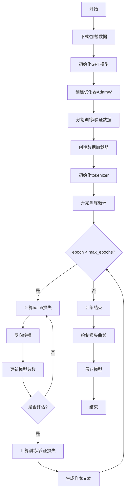
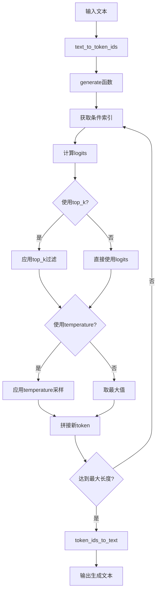
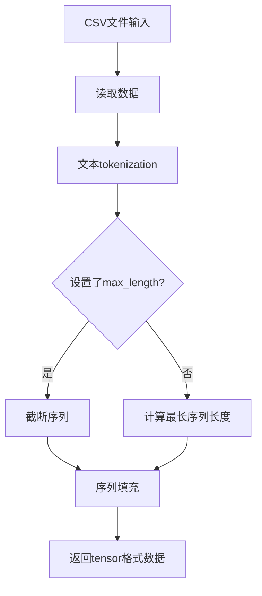
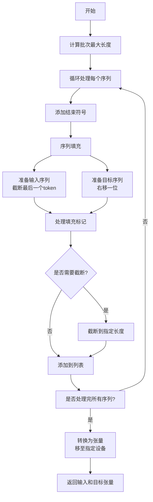

各个章节的关键代码
===

第二章
---
处理文本数据

### 数据集类 GPTDatasetV1
```python
class GPTDatasetV1(Dataset):
    def __init__(self, txt, tokenizer, max_length, stride):
        # 初始化输入-目标对
        self.input_ids = []
        self.target_ids = []

        # 分词化文本（利用传参的分词器）
        token_ids = tokenizer.encode(txt, allowed_special={"<|endoftext|>"})

        # 用滑动窗口创建输入-目标对
        for i in range(0, len(token_ids) - max_length, stride):
            input_chunk = token_ids[i:i + max_length]
            target_chunk = token_ids[i + 1: i + max_length + 1]
            # 填充输入块和目标块
            self.input_ids.append(torch.tensor(input_chunk))
            self.target_ids.append(torch.tensor(target_chunk))

    def __len__(self):
        return len(self.input_ids)

    def __getitem__(self, idx):
        return self.input_ids[idx], self.target_ids[idx]
```

### 数据加载器函数 create_dataloader_v1
```python
def create_dataloader_v1(txt, batch_size, max_length, stride,
                         shuffle=True, drop_last=True, num_workers=0):
    # 初始化分词器
    tokenizer = tiktoken.get_encoding("gpt2")

    # 创建数据集
    dataset = GPTDatasetV1(txt, tokenizer, max_length, stride)

    # 创建数据加载器
    dataloader = DataLoader(
        dataset, batch_size=batch_size, shuffle=shuffle, drop_last=drop_last, num_workers=num_workers)

    return dataloader
```

第三章
---
实现注意力机制

### 可训练参数，单层注意力，无因果掩码


```python
class SelfAttention_v2(nn.Module):

    def __init__(self, d_in, d_out, qkv_bias=False):
        super().__init__()
        # 创建三个可训练参数 W_query, W_key, W_value
        self.W_query = nn.Linear(d_in, d_out, bias=qkv_bias)
        self.W_key   = nn.Linear(d_in, d_out, bias=qkv_bias)
        self.W_value = nn.Linear(d_in, d_out, bias=qkv_bias)

    def forward(self, x):
        keys = self.W_key(x)
        queries = self.W_query(x)
        values = self.W_value(x)
        
        # 计算注意力分数
        attn_scores = queries @ keys.T
        # Softmax 归一化得到注意力权重
        attn_weights = torch.softmax(attn_scores / keys.shape[-1]**0.5, dim=-1)
        # 计算上下文向量 Z
        context_vec = attn_weights @ values
        return context_vec
```

### 有因果掩码，多头注意力


```python
class MultiHeadAttention(nn.Module):
    def __init__(self, d_in, d_out, context_length, dropout, num_heads, qkv_bias=False):
        super().__init__()
        assert (d_out % num_heads == 0), \
            "输出维度必须能被注意力头数整除"

        self.d_out = d_out              # 输出维度
        self.num_heads = num_heads      # 注意力头数
        self.head_dim = d_out // num_heads  # 每个注意力头的维度

        # 用于计算查询(Q)、键(K)和值(V)的线性变换层
        self.W_query = nn.Linear(d_in, d_out, bias=qkv_bias)
        self.W_key = nn.Linear(d_in, d_out, bias=qkv_bias)
        self.W_value = nn.Linear(d_in, d_out, bias=qkv_bias)
        self.out_proj = nn.Linear(d_out, d_out)  # 合并多头输出的线性层
        self.dropout = nn.Dropout(dropout)
        
        # 注册因果掩码（确保模型只能看到当前及之前的token）
        self.register_buffer(
            "mask",
            torch.triu(torch.ones(context_length, context_length),
                       diagonal=1)
        )

    def forward(self, x):
        b, num_tokens, d_in = x.shape   # 批次大小、序列长度、输入维度

        # 计算查询、键、值矩阵
        keys = self.W_key(x)            # 形状: (b, num_tokens, d_out)
        queries = self.W_query(x)
        values = self.W_value(x)

        # 通过添加num_heads维度来隐式分割矩阵
        # 重塑维度: (b, num_tokens, d_out) -> (b, num_tokens, num_heads, head_dim)
        keys = keys.view(b, num_tokens, self.num_heads, self.head_dim) 
        values = values.view(b, num_tokens, self.num_heads, self.head_dim)
        queries = queries.view(b, num_tokens, self.num_heads, self.head_dim)

        # 转置: (b, num_tokens, num_heads, head_dim) -> (b, num_heads, num_tokens, head_dim)
        keys = keys.transpose(1, 2)
        queries = queries.transpose(1, 2)
        values = values.transpose(1, 2)

        # 使用因果掩码计算缩放点积注意力
        attn_scores = queries @ keys.transpose(2, 3)  # 计算每个头的点积注意力分数

        # 将原始掩码截断到实际token数量并转换为布尔值
        mask_bool = self.mask.bool()[:num_tokens, :num_tokens]

        # 使用掩码填充注意力分数
        attn_scores.masked_fill_(mask_bool, -torch.inf)
        
        # 计算注意力权重并应用dropout
        attn_weights = torch.softmax(attn_scores / keys.shape[-1]**0.5, dim=-1)
        attn_weights = self.dropout(attn_weights)

        # 计算上下文向量 形状: (b, num_tokens, num_heads, head_dim)
        context_vec = (attn_weights @ values).transpose(1, 2) 
        
        # 合并所有注意力头的输出，其中 self.d_out = self.num_heads * self.head_dim
        context_vec = context_vec.contiguous().view(b, num_tokens, self.d_out)
        context_vec = self.out_proj(context_vec)  # 可选的输出投影

        return context_vec
```

> 什么是 buffer？
> 
> - *Parameters: 需要梯度、会被优化器更新*
> - Buffers: 不需要梯度、不会被优化器更新
>
> Buffers 是**模型中不需要计算梯度的张量参数**，通常把*注意力掩码，batch norm 参数等* 注册为 buffer。

第四章
---
实现GPT来生成文本

### 定义模型参数
```python
GPT_CONFIG_124M = {
        "vocab_size": 50257,     # 词汇表大小 
        "context_length": 1024,  # 上下文长度
        "emb_dim": 768,         # 嵌入维度
        "n_heads": 12,          # 注意力头数量
        "n_layers": 12,         # 层数
        "drop_rate": 0.1,       # Dropout率
        "qkv_bias": False       # 查询-键-值偏置项
    }
```

### GPT其他部分的实现

#### 层归一化
```python
class LayerNorm(nn.Module):
    def __init__(self, emb_dim):
        super().__init__()
        self.eps = 1e-5
        self.scale = nn.Parameter(torch.ones(emb_dim))
        self.shift = nn.Parameter(torch.zeros(emb_dim))

    def forward(self, x):
        mean = x.mean(dim=-1, keepdim=True)
        var = x.var(dim=-1, keepdim=True, unbiased=False)
        norm_x = (x - mean) / torch.sqrt(var + self.eps)
        return self.scale * norm_x + self.shift
```

#### 激活函数（GELU）
```python
class GELU(nn.Module):
    def __init__(self):
        super().__init__()

    def forward(self, x):
        return 0.5 * x * (1 + torch.tanh(
            torch.sqrt(torch.tensor(2.0 / torch.pi)) *
            (x + 0.044715 * torch.pow(x, 3))
        ))
```

#### 前馈网络
```python
class FeedForward(nn.Module):
    def __init__(self, cfg):
        super().__init__()
        self.layers = nn.Sequential(
            nn.Linear(cfg["emb_dim"], 4 * cfg["emb_dim"]),
            GELU(),
            nn.Linear(4 * cfg["emb_dim"], cfg["emb_dim"]),
        )

    def forward(self, x):
        return self.layers(x)
```

### 封装 Transformer 层


```python
class TransformerBlock(nn.Module):
    def __init__(self, cfg):
        super().__init__()
        # 多头注意力
        self.att = MultiHeadAttention(
            d_in=cfg["emb_dim"],
            d_out=cfg["emb_dim"],
            context_length=cfg["context_length"],
            num_heads=cfg["n_heads"],
            dropout=cfg["drop_rate"],
            qkv_bias=cfg["qkv_bias"])
        # 前馈网络
        self.ff = FeedForward(cfg)
        # 层归一化
        self.norm1 = LayerNorm(cfg["emb_dim"])
        self.norm2 = LayerNorm(cfg["emb_dim"])
        # Dropout
        self.drop_shortcut = nn.Dropout(cfg["drop_rate"])

    def forward(self, x):
        # 残差连接和层归一化
        shortcut = x
        x = self.norm1(x)
        x = self.att(x)   # Shape [batch_size, num_tokens, emb_size]
        x = self.drop_shortcut(x)
        x = x + shortcut  # Add the original input back

        # Shortcut connection for feed-forward block
        shortcut = x
        x = self.norm2(x)
        x = self.ff(x)
        x = self.drop_shortcut(x)
        x = x + shortcut  # Add the original input back

        return x
```

### GPT模型


```python
class GPTModel(nn.Module):
    def __init__(self, cfg):
        super().__init__()
        # 词嵌入
        self.tok_emb = nn.Embedding(cfg["vocab_size"], cfg["emb_dim"])
        # 位置嵌入
        self.pos_emb = nn.Embedding(cfg["context_length"], cfg["emb_dim"])
        # Dropout
        self.drop_emb = nn.Dropout(cfg["drop_rate"])
        # Transformer 层
        self.trf_blocks = nn.Sequential(
            *[TransformerBlock(cfg) for _ in range(cfg["n_layers"])])
        # 层归一化
        self.final_norm = LayerNorm(cfg["emb_dim"])
        # 输出层
        self.out_head = nn.Linear(cfg["emb_dim"], cfg["vocab_size"], bias=False)

    def forward(self, in_idx):
        batch_size, seq_len = in_idx.shape
        tok_embeds = self.tok_emb(in_idx)
        pos_embeds = self.pos_emb(torch.arange(seq_len, device=in_idx.device))
        x = tok_embeds + pos_embeds  # Shape [batch_size, num_tokens, emb_size]
        x = self.drop_emb(x)
        x = self.trf_blocks(x)
        x = self.final_norm(x)
        logits = self.out_head(x)
        return logits
```

第五章
---
在无标签数据上预训练

### 从头开始训练模型



#### 计算损失函数
```python
def calc_loss_loader(data_loader, model, device, num_batches=None):

    total_loss = 0.  # 初始化总损失
    
    # 如果数据加载器为空,返回NaN
    if len(data_loader) == 0:
        return float("nan")
    elif num_batches is None:
        num_batches = len(data_loader)  # 如果未指定批次数,使用全部批次
    else:
        # 如果指定的批次数超过数据加载器的批次总数,则使用实际的批次总数
        num_batches = min(num_batches, len(data_loader))
    
    # 遍历数据加载器中的批次
    for i, (input_batch, target_batch) in enumerate(data_loader):
        if i < num_batches:
            # 计算当前批次的损失并累加
            loss = calc_loss_batch(input_batch, target_batch, model, device)
            total_loss += loss.item()
        else:
            break
            
    # 返回平均损失
    return total_loss / num_batches
```

#### 在有监督数据上训练
```python
def train_classifier_simple(model, train_loader, val_loader, optimizer, device, num_epochs,
                            eval_freq, eval_iter):
    # 初始化列表以跟踪损失和已处理样本数
    train_losses, val_losses, train_accs, val_accs = [], [], [], []
    examples_seen, global_step = 0, -1

    # 主训练循环
    for epoch in range(num_epochs):
        model.train()  # 设置模型为训练模式

        for input_batch, target_batch in train_loader:
            optimizer.zero_grad() # 重置梯度
            loss = calc_loss_batch(input_batch, target_batch, model, device)
            loss.backward() # 计算梯度
            optimizer.step() # 更新参数
            examples_seen += input_batch.shape[0] # 记录已处理样本数（画图用）
            global_step += 1

            # 每 eval_freq 步评估模型
            if global_step % eval_freq == 0:
                train_loss, val_loss = evaluate_model(
                    model, train_loader, val_loader, device, eval_iter)
                train_losses.append(train_loss)
                val_losses.append(val_loss)
                print(f"Ep {epoch+1} (Step {global_step:06d}): "
                      f"Train loss {train_loss:.3f}, Val loss {val_loss:.3f}")

        # 每个epoch结束后评估模型
        train_accuracy = calc_accuracy_loader(train_loader, model, device, num_batches=eval_iter)
        val_accuracy = calc_accuracy_loader(val_loader, model, device, num_batches=eval_iter)
        print(f"Training accuracy: {train_accuracy*100:.2f}% | ", end="")
        print(f"Validation accuracy: {val_accuracy*100:.2f}%")
        train_accs.append(train_accuracy)
        val_accs.append(val_accuracy)

    return train_losses, val_losses, train_accs, val_accs, examples_seen
```

### 生成文本（使用OpenAI的GPT-2模型）


#### 文本 $ \leftrightarrow $ token_id 转换函数
```python
def text_to_token_ids(text, tokenizer):
    encoded = tokenizer.encode(text)
    encoded_tensor = torch.tensor(encoded).unsqueeze(0)  # add batch dimension
    return encoded_tensor


def token_ids_to_text(token_ids, tokenizer):
    flat = token_ids.squeeze(0)  # remove batch dimension
    return tokenizer.decode(flat.tolist())
```

#### 生成文本函数
```python
def generate(model, idx, max_new_tokens, context_size, temperature=0.0, top_k=None, eos_id=None):

    # 使用循环遍历：获取logits，只关注最后一个时间步
    for _ in range(max_new_tokens):
        idx_cond = idx[:, -context_size:]
        with torch.no_grad():
            logits = model(idx_cond)
        logits = logits[:, -1, :]

        # 新增：使用top_k采样过滤logits
        if top_k is not None:
            # 只保留top_k个值
            top_logits, _ = torch.topk(logits, top_k)
            min_val = top_logits[:, -1]
            logits = torch.where(logits < min_val, torch.tensor(float("-inf")).to(logits.device), logits)

        # 新增：应用温度缩放
        if temperature > 0.0:
            logits = logits / temperature

            # 应用softmax获取概率分布
            probs = torch.softmax(logits, dim=-1)  # (batch_size, context_len)

            # 从分布中采样
            idx_next = torch.multinomial(probs, num_samples=1)  # (batch_size, 1)

        # 否则与之前相同：获取具有最高logits值的词汇表条目的索引
        else:
            idx_next = torch.argmax(logits, dim=-1, keepdim=True)  # (batch_size, 1)

        # 如果遇到结束序列标记且指定了eos_id，则提前停止生成
        if idx_next == eos_id:
            break

        # 与之前相同：将采样的索引附加到运行序列中
        idx = torch.cat((idx, idx_next), dim=1)  # (batch_size, num_tokens+1)

    return idx
```

第六章
---
分类任务微调

### 数据集和数据加载器




> 复用之前的数据加载器，制作`train_loader` 和 `valid_loader`

### 构建分类器


```python
torch.manual_seed(123)

num_classes = 2
model.out_head = torch.nn.Linear(in_features=BASE_CONFIG["emb_dim"], out_features=num_classes)
```

### 把模型用于垃圾邮件分类

```python
def classify_review(text, model, tokenizer, device, max_length=None, pad_token_id=50256):
    model.eval()

    # 对文本进行分词
    input_ids = tokenizer.encode(text)
    supported_context_length = model.pos_emb.weight.shape[0]

    # 截断序列（如果太长）
    input_ids = input_ids[:min(max_length, supported_context_length)]

    # 填充序列
    input_ids += [pad_token_id] * (max_length - len(input_ids))
    input_tensor = torch.tensor(input_ids, device=device).unsqueeze(0) # add batch dimension

    # 生成模型输出
    with torch.no_grad():
        logits = model(input_tensor)[:, -1, :]  # Logits of the last output token
    predicted_label = torch.argmax(logits, dim=-1).item()

    # 返回预测标签
    return "spam" if predicted_label == 1 else "not spam"
```

第七章
---
指令微调

### 数据集和数据加载器
#### 转换为Prompt Style
```python
def format_input(entry):
    instruction_text = (
        f"Below is an instruction that describes a task. "
        f"Write a response that appropriately completes the request."
        f"\n\n### Instruction:\n{entry['instruction']}"
    )

    input_text = f"\n\n### Input:\n{entry['input']}" if entry["input"] else ""

    return instruction_text + input_text
```

#### 创建指令数据集
```python
class InstructionDataset(Dataset):
    def __init__(self, data, tokenizer):
        self.data = data

        # 初始化编码文本列表
        self.encoded_texts = []
        # 遍历数据并编码
        for entry in data:
            # 格式化输入
            instruction_plus_input = format_input(entry)
            # 格式化输出
            response_text = f"\n\n### Response:\n{entry['output']}"
            # 合并文本
            full_text = instruction_plus_input + response_text
            # 编码文本
            self.encoded_texts.append(
                tokenizer.encode(full_text)
            )

    def __getitem__(self, index):
        return self.encoded_texts[index]

    def __len__(self):
        return len(self.data)
```

#### 制作输入-目标对


> 匆忙结束...
> 剩下的都差不多了
> 自动会话基准评估我也晕晕的就不看了😊