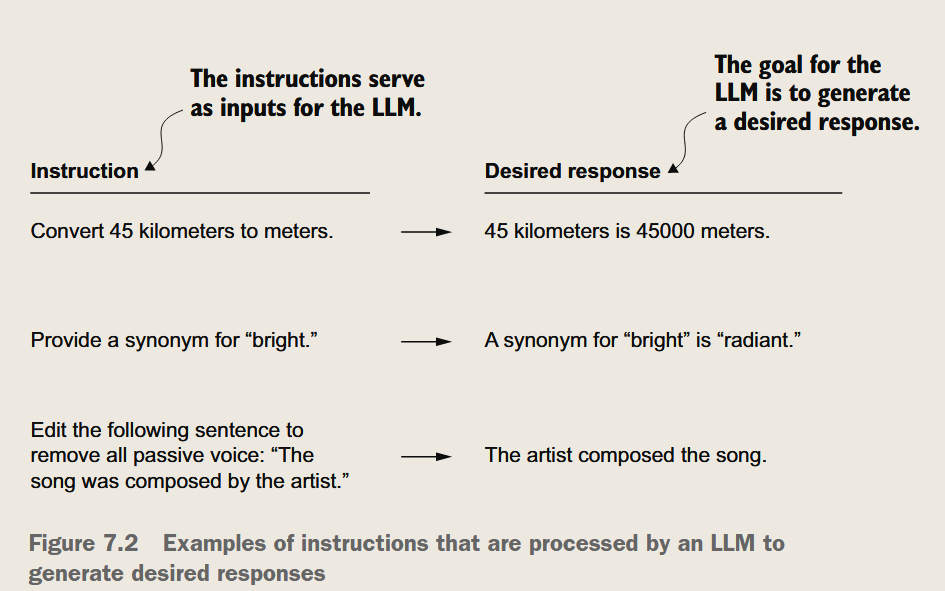
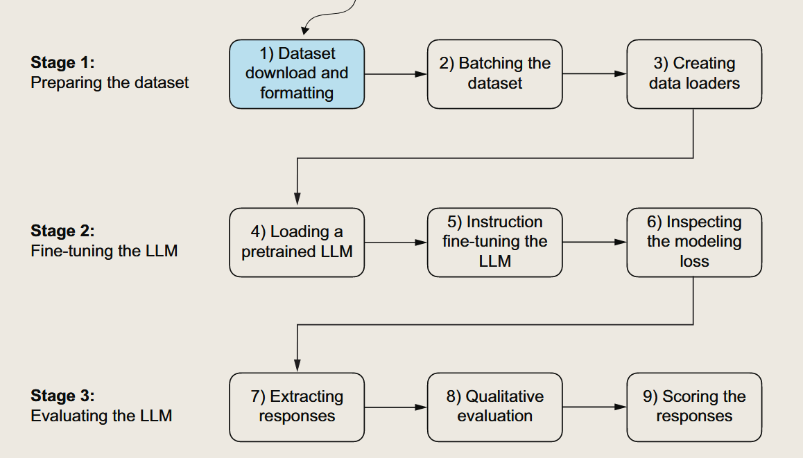
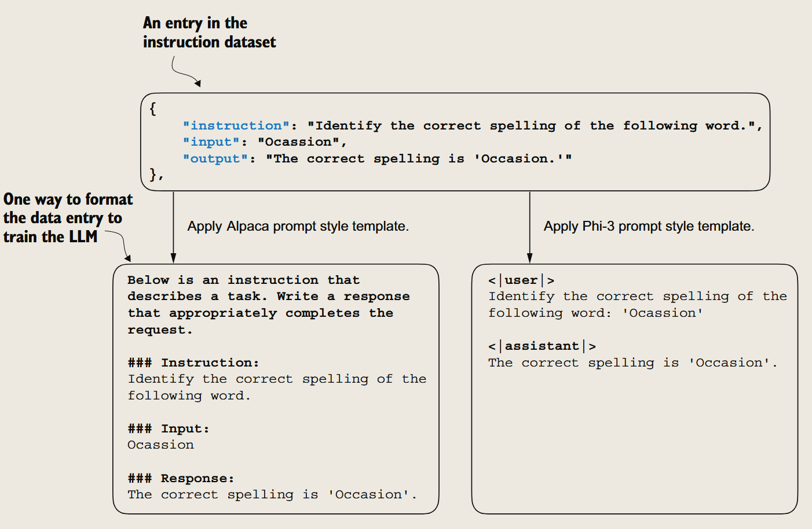
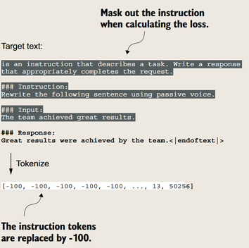
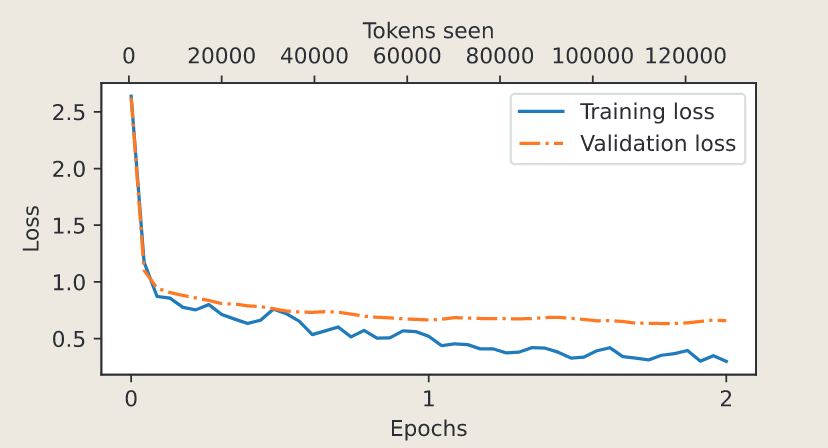

微调来接收指令
---


目标是从prompt+input，从prompt的第一个词开始一个一个token地预测，最后提取出output(自回归)

让模型“听懂”指令，然后执行指令


*训练指令微调的三个步骤：准备数据，微调模型，评估模型*

### 阶段一：准备指令数据集
#### 1. 数据集
由instruction + input -> output组成


```
Example entry: 
{'instruction': "What is an antonym of 'complicated'?", 
'input': '', 
'output': "An antonym of 'complicated' is 'simple'."}
```
*数据长这样。input也可以为空*

##### 转换Prompt风格（预处理）

为了适配已有的微调框架，让推理效果更稳定，我们会转换成特定Prompt Style例如Alpaca或者Phi-3

##### 划分数据集

#### 2. 数据加载器
##### 自制数据加载器

*步骤*：
改用Prompt模板 → 分词  → 把句子Padding到相同长度 → 创建目标向量 → 对齐


*在计算损失时，通过掩膜把指令和输入的token id 设置为-100，只会统计输出的损失*

> 对于在指令微调过程中屏蔽指令是否普遍有益，还存在分歧

#### 3. 利用数据加载器实现批处理
(略)

### 阶段二：微调模型
#### 4. 加载预训练模型
使用"gpt2-medium (355M)"

#### 5. 在指令数据集上微调模型

### 阶段三：评估模型


#### 6. 提取模型的响应
(略)

#### 7. 评估模型的性能
评价方法：
- 简答题和多选题的准确率：测试一般知识
- 人类偏好与其他LLM的比较：测试指令理解能力
- 自动会话基准：测试模型的对话能力

> 人类评估：数据宝贵，但效率低
> - 常见方法：A/B测试，量表打分
> 
> 自动评估：用代码跑标准测试集
> - 常见方法：BLEU，ROUGE，Perplexity


### 指令微调过程小结

#### 1. 数据准备
- 下载指令-响应数据集
- 格式化数据条目
- 划分训练集、验证集和测试集

#### 2. 训练数据处理
- 使用自定义整理函数(custom_collate_fn)构建训练批次
- 填充序列到统一长度
- 创建目标标记ID
- 对填充标记进行屏蔽处理

#### 3. 模型选择与训练
- 使用预训练的GPT-2中型模型(355M参数)
- 采用与预训练相似的训练循环
- 在指令数据集上进行微调

#### 4. 评估方法
- 在测试集上提取模型响应
- 使用Ollama应用程序(8B参数Llama模型)进行自动评分
- 计算平均分以量化模型性能

---
## 参考资源

### 学习资源
- 机器学习最新论文：[arxiv.org/list/cs.LG/recent](https://arxiv.org/list/cs.LG/recent)
  > 及时了解机器学习领域的前沿研究动态
- 作者个人博客：[sebastianraschka.com/blog](https://sebastianraschka.com/blog/)
  > 获取作者的最新研究和教程

### 实用工具
- [Axolotl](https://github.com/axolotl-ai-cloud/axolotl)
  > 封装好的LLM后处理工具，简化模型训练流程（简单一些些）
- [LitGPT](https://github.com/Lightning-AI/litgpt)
  > 基于PyTorch Lightning的GPT实现

---
> 完结撒花！🎉
> 