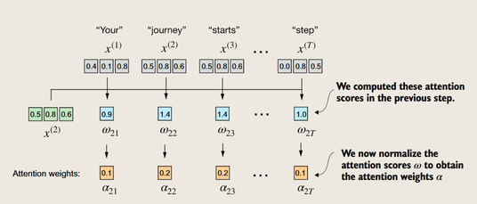
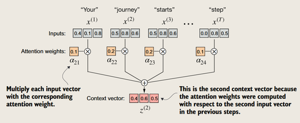
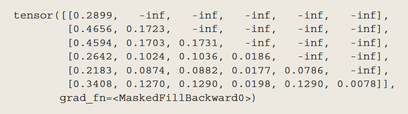

注意力机制


#### 章节介绍

本章介绍上图的Stage1的第二步

#### 为什么要注意力机制
翻译问题：上下文
-> **编码器-解码器**结构

- 编码器首先读取整个文本
- 解码器生成翻译

##### RNN的编码器-解码器

*句子的语义储存在编码器的隐藏层中（向量），然后解码器根据当前语义生成翻译*

RNN无法访问之前的隐藏状态 -> **长距离依赖问题**

##### 自注意力的“自”

 序列中的每个元素都会与序列的所有元素（包括自身）计算注意力分数

> 注意力分数
>
> **衡量一个元素（比如一个词）对另一个元素的重要性**
> 
> *相当于对一个query，计算所有key的分数(SOFMAX)，然后对value加权求和*

### 简单的自注意力（无可训练参数）


*注意力分数w -> 权重a *

*权重a -> 加权求和*

> 点乘可以衡量两个向量的相似性

#### 代码演示
```python
晕了
```

### 含可训练参数的自注意力（Scaled Dot-Product Attention）
三个可训练的权重矩阵 Wq、Wk 和 Wv -> 三个向量 query、key 和 value

> 输入向量 X 线性变换得到三种向量: Query（查询）、Key（键）、Value（值）
>
> - 由 Query 点乘 Key 得到注意力分数 W
> - 由 $W \over \sqrt(d_k)$ 做 SOFTMAX 得到权重 a
> - 由 a 点乘 Value 得到加权求和


*完整过程*

### 因果注意力（Causal Attention）
也成为掩膜自注意力（Masked Self-Attention）


利用下三角矩阵制作掩膜，由于-∞会被 SOFTMAX 压缩到 0 的特性，让模型不能偷看未来的信息



#### 加入DROP-OUT

防止query和某个key过于依赖，导致过拟合

*利用掩膜对注意力权重矩阵进行DROP-OUT*

> dropout以后的剩余元素需要被**缩放**（确保输出的期望值不变），*就像有员工请假，那么剩下的员工需要加班）*

### 多头注意力（Multi-Head Attention， MHA）


先**并行**计算多组单头注意力


再concatenate拼接这些矩阵，再线性变换

### 小结
#### 基础概念
- **注意力机制**的核心功能：将输入元素转换为*增强的上下文向量表示*，包含所有输入的信息。

#### 自注意力机制
- 核心原理：将上下文向量表示计算为输入的**加权和**
  - *通过点积计算注意力权重*
  - *使用矩阵乘法*替代嵌套的for循环，提高计算效率

#### 大型语言模型(LLM)的自注意力特点
- 包含**可训练的权重矩阵**，用于计算:
  - *查询(Query)*
  - *键(Key)*
  - *值(Value)*
- 使用**因果注意力掩码**防止访问未来标记
- 添加*dropout掩码*减少过拟合

#### 多头注意力模块实现
- 通过**堆叠多个因果注意力模块**实例
- 使用*批量矩阵乘法*提高计算效率