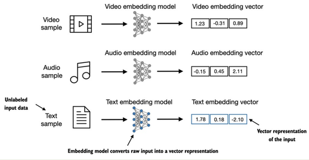
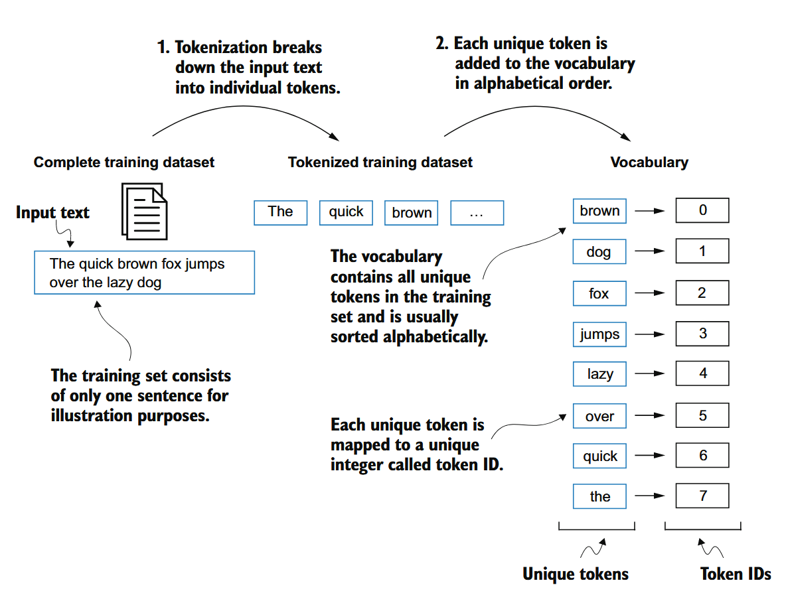

### 了解词嵌入
#### 为什么需要词嵌入

*把无法直接处理的文本/视频数据转换为可以处理的**数字**数据*

#### 词嵌入的思想
word2vec

    **上下文相似的词，其含义可能相近** -> one-hot编码

#### 词嵌入可视化

*然而高维数据无法直观展示，例如GPT-3的词嵌入维度为12288*

当然，大模型通常有自己的词嵌入作为输入层一部分，针对特定任务进行训练。

### 词嵌入流程

#### 1. 分词
把**输入**的文本**分割成单词**或者子词

*分词不是简单的re*。而是根据上下文和语法规则进行分析。

同时要确保**特殊字符**，标点甚至空格的保留

#### 2. 转换为token ID

构建词汇表，把**单词映射为唯一的ID**

从分词到ID的过程

构建了词汇表以后，既可以把文本的单词转换为ID，也可以把输出向量从ID转换为单词得到**新句子**

####  人为定义的ID
`“... in a thrilling overtime victory. <|endoftext|> ... days happily ever after. <|endoftext|> ... marking its highest gain in the past three months. <|endoftext|> ... journey had forever changed her heart.”`

例如用EOS表示句子结束，用BOS表示句子开始，用UNK表示未知单词……

> 注意
>
> 由于使用掩膜，所以这些特殊的token不产生影响

#### BPE
Byte Pair Encoding

    1. 从字符开始
    2. 逐渐合并成词(根据出现频率)
    3. 直到达到词表大小

例如：
d+e -> de -> de+r -> der -> der+i -> deri -> deriv -> derivi -> derivin -> derivin+g -> deriving

BPE相当于把**分词和ID映射**合并到一起

*BPE会在编码时把未登录词分解为子词甚至字母，从而避免词汇表unknown的问题*

### 创建“下一词预测任务”

在**训练过程中**，模型会根据**上下文**预测**下一个词**  
用一个**窗口**来滑动，每次预测**窗口内的下一个词**
然后根据预测结果和窗口对应的原文（目标词）计算损失，更新参数

