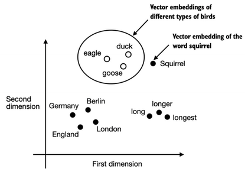
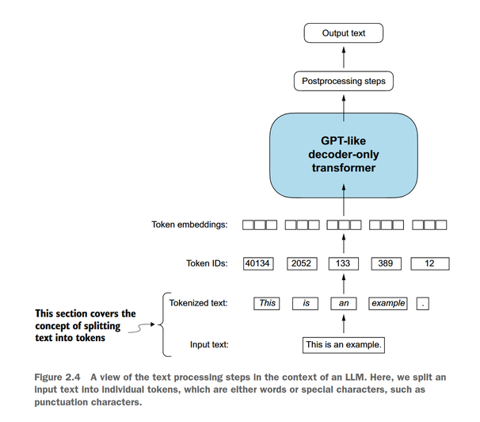
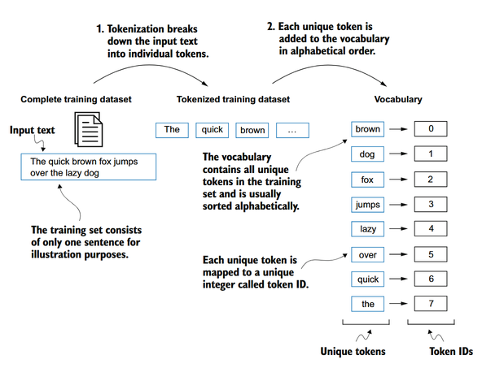
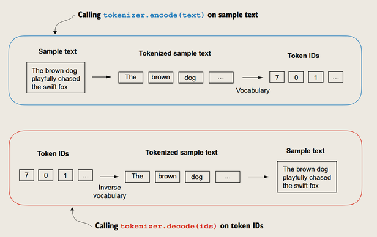
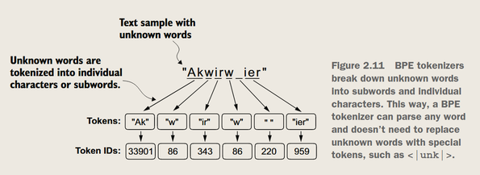
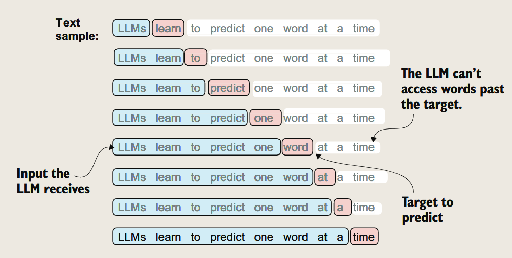
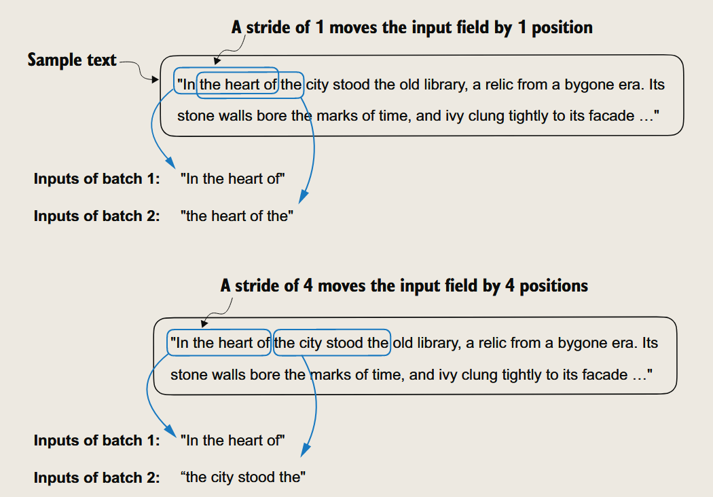

处理文本数据
---

### 了解词嵌入
#### 为什么需要词嵌入

*把无法直接处理的文本/视频数据转换为可以处理的**数字**数据*

#### 词嵌入的思想
word2vec

    **上下文相似的词，其含义可能相近** -> one-hot编码

#### 词嵌入可视化

*然而高维数据无法直观展示，例如GPT-3的词嵌入维度为12288*

当然，大模型通常有自己的词嵌入作为输入层一部分，针对特定任务进行训练。

### 词嵌入流程


#### 1. 分词
把**输入**的文本**分割成单词**或者子词

*分词不是简单的re*。而是根据上下文和语法规则进行分析。

同时要确保**特殊字符**，标点甚至空格的保留

#### 2. 转换为token ID

构建词汇表，把**单词映射为唯一的ID**


从分词到ID的过程


构建了词汇表以后，既可以把文本的单词转换为ID，也可以把输出向量从ID转换为单词得到**新句子**

####  人为定义的ID
`“... in a thrilling overtime victory. <|endoftext|> ... days happily ever after. <|endoftext|> ... marking its highest gain in the past three months. <|endoftext|> ... journey had forever changed her heart.”`

例如用EOS表示句子结束，用BOS表示句子开始，用UNK表示未知单词……

> 注意
>
> 由于使用掩膜，所以这些特殊的token不产生影响

#### BPE
Byte Pair Encoding

    1. 从字符开始
    2. 逐渐合并成词(根据出现频率)
    3. 直到达到词表大小

例如：
d+e -> de -> de+r -> der -> der+i -> deri -> deriv -> derivi -> derivin -> derivin+g -> deriving

BPE相当于把**分词和ID映射**合并到一起


*BPE会在编码时把未登录词分解为子词甚至字母，从而避免词汇表unknown的问题*

### 创建“下一词预测任务”

在**训练过程中**，模型会根据**上下文**预测**下一个词**  
用一个**窗口**来滑动，每次预测**窗口内的下一个词**
然后根据预测结果和窗口对应的原文（目标词）计算损失，更新参数



#### 构建输入-目标对
遍历文本
- LLM看到的是**输入**，即窗口内的词
- LLM的目标是**输出**，即窗口内的下一个词

=> 创建一个**数据加载器**，把文本转换为**输入-目标对**
```python
def create_dataloader_v1(txt, batch_size=4, max_length=256, stride=128, shuffle=True, drop_last=True, num_workers=0):
    tokenizer = tiktoken.get_encoding("gpt2")
    dataset = GPTDatasetV1(txt, tokenizer, max_length, stride)
    dataloader = DataLoader(
        dataset,
        batch_size=batch_size,
        shuffle=shuffle,
        drop_last=drop_last,
        num_workers=num_workers
    )
    return dataloader
```
> *理解步长*
> 
> 
>
> 参数：步长，窗口大小，文本长度
>
> 步长小于窗口大小，会有重叠（好），步长大于窗口大小，会有间隔（坏）

### 为Token ID创建Embedding

Embedding层本质上是一个**查找表**

把*离散的* **token ID**映射为*连续的* **词嵌入向量**

捕捉到**词之间的关系**（相似的词有相似的向量）

> *Embedding和one-hot编码的区别*
>
> one-hot就像给id一个编号，每个id独立，高维稀疏
>
>`[1, 0, 0], [0, 1, 0], [0, 0, 1]`
>
> Embedding就像给id一个坐标，id之间有位置关系，低维稠密
>
>`[0.1, 0.2, 0.3], [0.4, 0.5, 0.6], [0.7, 0.8, 0.9]`

*当tokens很多时，one-hot参数要包含所有token的矩阵，而Embedding只需要包含词嵌入的维度，参数更少*

### 位置编码

自注意力机制是**无状态**的，无法区分词的位置

*boy chase dog*和*dog chase boy*的区别在于**词的位置**（两处chase的token ID相同，词嵌入相同，但显然意义不同）

=> 为了区分词的位置，需要**位置编码**

相对位置编码：
`[[0, 1, 2, 3],
 [-1, 0, 1, 2],
 [-2, -1, 0, 1],
 [-3, -2, -1, 0]]`
 正数表示右侧，负数表示左侧

 => 捕捉局部特征，泛化能力强

### 小结

- **大型语言模型**（*LLMs*）需要将文本数据转换为数值向量，称为**嵌入**（*embeddings*），因为它们无法处理原始文本。嵌入将离散数据（如单词或图像）转换为连续的向量空间，使其能够与神经网络操作兼容。

- 第一步，原始文本被分解为**标记**（*tokens*），这些标记可以是单词或字符。然后，这些标记被转换为整数表示，称为**标记ID**（*token IDs*）。

- 可以添加特殊标记，例如 `<|unk|>` 和 `<|endoftext|>`，以增强模型的理解能力并处理各种上下文，例如未知单词或标记不相关文本之间的边界。

- 用于**GPT-2**和**GPT-3**等大型语言模型的**字节对编码**（*BPE*）分词器可以通过将未知词分解为子词单元或单个字符来高效处理这些词。

- 我们在分词数据上使用**滑动窗口**方法生成用于LLM训练的输入-目标对。

- **PyTorch**中的嵌入层作为查找操作，检索与词元ID对应的向量。生成的嵌入向量提供了词元的连续表示，这对于训练深度学习模型（如LLM）至关重要。

- 虽然词元嵌入为每个词元提供了一致的向量表示，但它们缺乏对词元在序列中位置的理解。为了解决这个问题，存在两种主要类型的位置嵌入：**绝对位置嵌入**和**相对位置嵌入**。*OpenAI*的**GPT**模型使用绝对位置嵌入，这些嵌入被添加到词元嵌入向量中，并在模型训练期间进行优化。