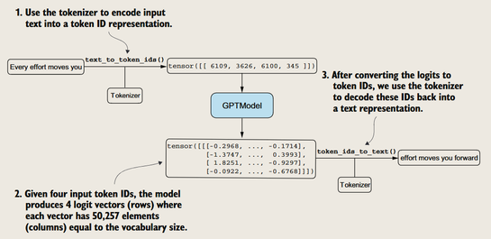
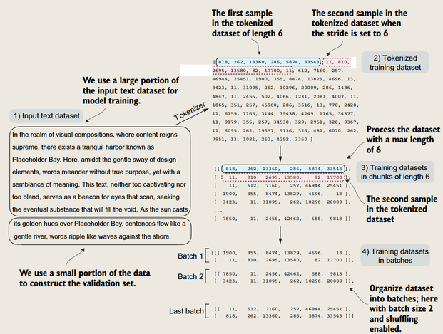
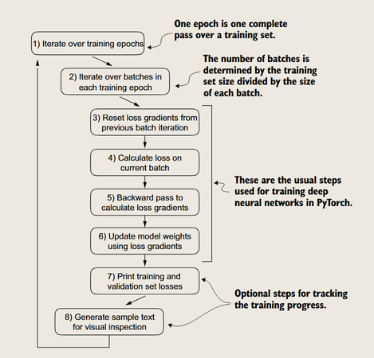
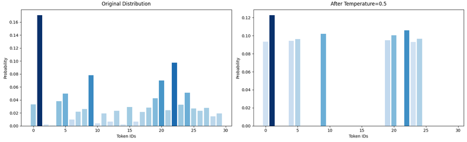

在无标签数据上预训练
---

这一章要解决预训练，训练，评估，和加载预训练模型的问题。

### 评价生成文本的模型

*回顾一下生成的过程*
- 文本分词为token，嵌入为向量
- 输入到GPT中，得到logits
- logits通过softmax得到概率分布
- 从概率分布中采样得到下一个token

#### 使用一个未经训练的模型

*一个简化的示意图*

初始的随机参数会得到随机的文本

**目标**：让logits对应目标token的概率最大（确保LLM始终选择目标token——本质上是句子中的下一个单词——作为它生成的下一个token。）

#### 评价模型
logits → softmax → 概率分布 → 评价目标token的概率（**交叉熵**）

> 只需要看目标token的概率，不需要看其他token的概率

> **补充**：**困惑度**（perplexity）$Perplexity = e^{Cross-Entropy-Loss}$，用于评价模型的好坏。困惑度越低，模型越自信。（当然啦，并不用于反向传播训练模型）

#### 数据加载器

*数据加载器的任务*

- 分词
- 按照max tokens分块
- 混洗（shuffle）整理成batch
- 划分为训练集和验证集

### 预训练
> **注意**：模型参数是由训练集更新的，验证集能修改超参数。测试集最后评价，不会参与训练。

*预训练的过程*

1. 遍历训练集（多个 epoch）

2. 在每个 epoch 内：

   - 遍历每个 batch（小批量训练）
   - **重置梯度**（防止累积上个 batch 的梯度）
   - **前向传播**（计算 logits 和 loss）
   - **反向传播**（计算梯度）
   - **更新参数**（如用 Adam、SGD 调整权重）
   - （可选）打印 loss、学习率等调试信息
   - 遍历完所有 batch，结束一个 epoch

3. 用验证集评估模型

   - **计算验证 loss 和准确率**
   - 如果验证 loss 下降，继续训练
   - 如果验证 loss 上升，可能调整超参数（如早停）

4. **（最终）在测试集上评估模型**

> 在更新参数时，选择 AdamW 优化器，修正L2正则化的问题。

> 通常情况下，人们会在更大的数据集上只训练一个epoch，甚至不到一个epoch🚀

### 解码策略

#### 贪心解码
每次选择概率最大的token

#### 温度缩放

- 温度为1时，没有缩放
- 温度为0时，缩放到最大的概率
- 温度大于1时，概率分布变得更均匀
- 温度小于1时，概率分布变得更加“自信”

> softmax对应的是采样的**概率**，而不是选择得分最高的token

#### Top-k采样

仅仅调温度还不够，还需要用 Top-k 或 Top-p 过滤掉低分词，避免无意义 token 进入采样池。

*如上图，只有最高的 k个token会被保留*

### 加载OpenAI的GPT-2模型

*预训练模型的参数对应着gpt结构的哪一部分*

然后把openai的GPT-2模型的参数加载到我们的模型中，这样我们就可以使用它的预训练参数了。

## 小结

### 1. LLM的文本生成机制
- LLM采用逐标记(token)输出方式
- 默认使用"贪婪解码"策略：
  * 将模型输出转换为概率分数
  * 选择概率最高的标记作为输出

### 2. 文本生成的控制方法
- 通过概率采样进行调节
- 使用温度缩放参数影响：
  * 文本的多样性
  * 文本的连贯性

### 3. 模型质量评估方法
- 训练集损失评估
- 验证集损失评估
- 用于评估训练过程中生成文本的质量

### 4. LLM预训练特点
- 核心目标：
  * 最小化训练损失

- 标准训练流程：
  * 使用交叉熵损失
  * 采用AdamW优化器

- 实践建议：
  * 预训练需要大量时间和资源
  * 建议使用公开可用的预训练权重
  * 避免从零开始训练大型模型