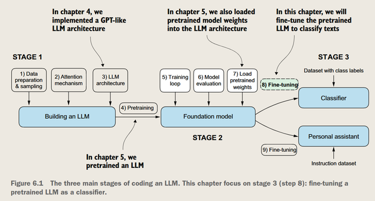
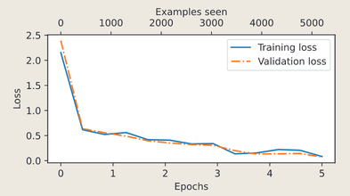

为分类任务做微调
---

*微调LLM的两种方式：1.分类任务；2.指令任务*

### 分类微调

*例如垃圾邮件分类任务（Spam），模型只会回答是或否，并不会理解邮件的内容*

分类微调相比于指令所需的数据集更小，算力要求更低

*构建分类模型的步骤*
- 准备数据集
- 准备模型（加载预训练模型）
- 微调模型

#### 准备数据集

- **平衡** spam 和 ham 的数量，为了保证模型在各类别上的表现均衡，防止“学习到更多非垃圾邮件的特征”

- 类别 → 0/1
- 数据集划分：训练集、验证集、测试集

#### 创建数据加载器

> **问**：数据集文本的长度不一致，如何处理？
>
> **答**：使用`Padding`和`<|endoftext|>`，将文本长度**填充**到最长文本的长度

*为了避免截断导致丢失长文本的信息，把短文本用50256填充到最长文本的长度*

> “0/1”标签是打在**句子上**的，而模型本身仍然是自回归的

#### 给原来的模型加上一个分类头

*位置：模型的最后一层*

GPT出来 → 前馈网络 → logits（长度50k+） → 线性层 → logits（长度2）→ softmax → 概率

> 现在是一个二分类任务，对于比如情感分析的多分类任务，只需要把线性层的输出维度改为类别数即可

> LLM的低层用于分析语义，只需要微调最后几层

最后线性层的输出是[batch_size, 2]，同样的，我们只需要关注最后一行，把它用于Softmax求出概率

> 由于因果注意力，最后一行积累的信息是最全面的

#### 在有监督的数据集上微调模型（其实就是训练）

*x轴有两个（examples和epochs）表示每个batch都会计算损失和更新参数，每个epoch包括很多个batch*

通常5个epoch用于**微调**防止过拟合

### 小结
- **微调 LLM** 有不同的策略，包括 *分类微调* 和 *指令微调*。
- **分类微调** 主要通过用一个小的分类层替换 **LLM** 的输出层实现。
  - 例如：在 *“垃圾邮件”* 或 *“非垃圾邮件”* 分类问题中，新的输出层只有两个节点，而 **预训练** 时输出层的节点数等于词汇表的大小（50,256 个）。
- **预训练** 时模型的任务是预测文本中的下一个标记，而 **分类微调** 则训练模型输出正确的类别标签。
- *微调模型输入* 依然是经过标记化转换的文本数据，与 **预训练** 类似。
- 在 *微调前* ，会加载 **预训练** 模型作为基础模型。
- **分类模型** 的评估通常通过计算分类准确率来进行。
- *微调时* 使用的损失函数仍然是交叉熵损失函数，与 **预训练** 时相同。