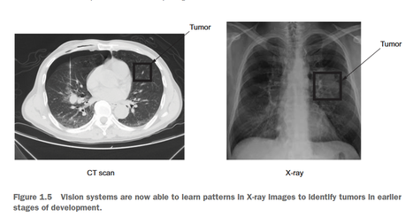
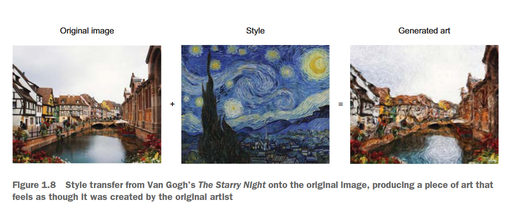
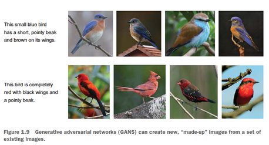
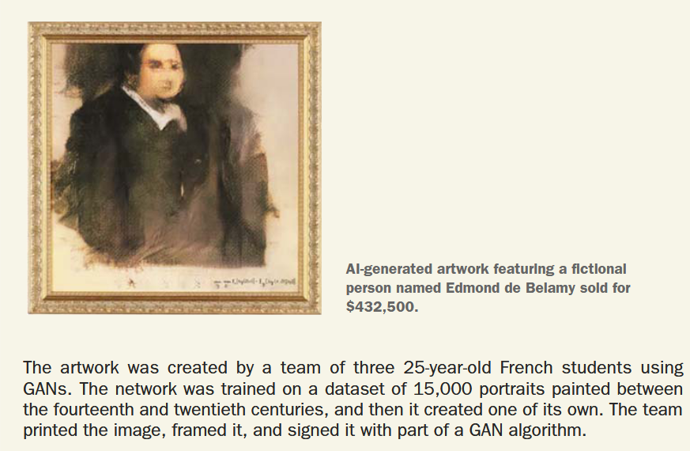
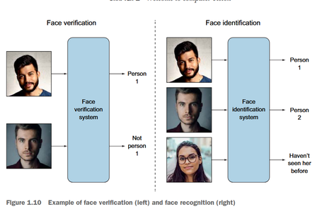
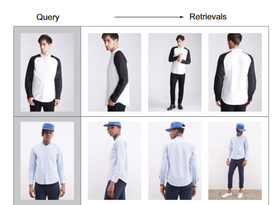
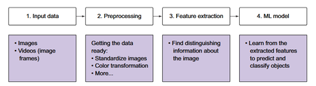
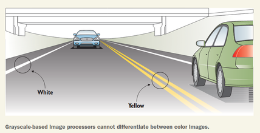
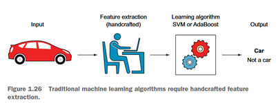
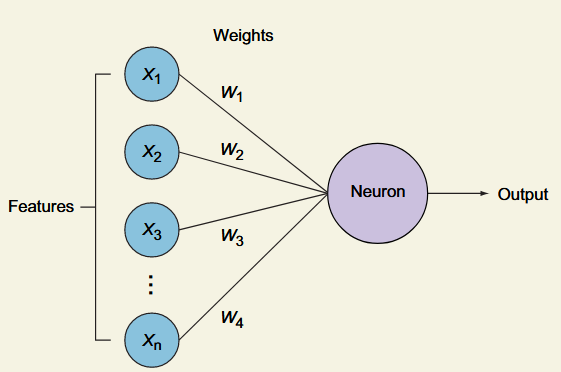

### 传统CV+ML的方向
- **识别分类/检测/分割**

    例如：肿瘤检测，人脸识别，车牌识别，目标检测，图像分割
    
- **风格迁移**

    例如：梵高画风迁移
    
- **生成图像**

    例如：GAN生成图像
    
    *在已有的大量图像上学习，才能生成新的图像*

> **趣闻**

> 由AI生成的艺术作品，展示了一个名为Edmond de Belamy的虚构人物，售价43.25万美元。

- **人脸识别/验证**

    人脸识别：给定一张人脸图像，判断这个人是谁
    
    人脸验证：给定一张人脸图像，判断这个人是不是某个人
    

- **图像推荐系统**

    例如：推荐相似风格的图片
    

### 视觉任务的一般步骤
**输入图像 -> 预处理 -> 特征提取 -> 分类/检测/分割**

#### 1.输入图像
图片 -> 矩阵 -> **函数**

*如， Color image in RGB => F(x, y) = [ red (x, y), green (x, y), blue (x, y) ]*

#### 2.预处理
- **转化为灰度图像** => 减少计算量

- **标准化** => 统一图像的尺寸和亮度等

- **数据增强** => 旋转、翻转、缩放等

> **补充**
> 彩色图片包含更多细节，可以用于肉眼无法从灰度图像中进行判别的场景
> 

#### 3.特征提取
原始数据 -> 特征提取算法（黑盒）-> **特征向量**

使用特征相比于原始数据，可以减少计算量，提高准确率

##### 什么是良好的特征？
- **可区分性**：不同类别的特征向量之间的距离尽可能大
- **鲁棒性**：对于噪声、光照、变形等具有一定的鲁棒性，尤其是在**遮挡一部分**的情况下仍然明显
- **便于跟踪和观测**：特征向量容易提取和比较

##### 人工特征工程 VS 深度学习

*人工利用 HOG, Harr Casacades, SIFT, SURF等特征提取算法，提取特征向量*

*神经网络通过迭代更新权重，找出**最有用**的特征*

### 章节小结

1. 人类和机器视觉系统都包含两个基本组件:感知设备和解释设备。

2. 解释过程包含四个步骤:输入数据、预处理、特征提取和生成机器学习模型。

3. 图像可以表示为x和y的函数。计算机将图像视为像素值矩阵:灰度图像为单通道,彩色图像为三通道。

4. 图像处理技术因问题和数据集而异。一些常用技术包括:
   - 将图像转换为灰度以降低复杂度
   - 将图像调整为统一大小以适应神经网络
   - 数据增强

5. 特征是图像中用于分类对象的独特属性。传统机器学习算法使用多种特征提取方法。