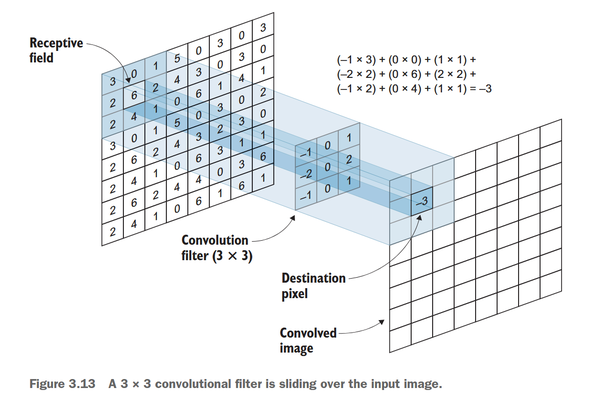
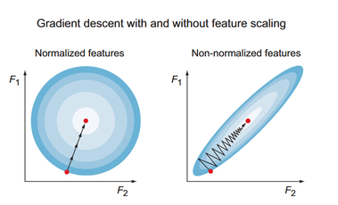

### MLP用于MNIST手写数字识别

#### 1. 展平
MLP接受的是一维输入 => **展平（flatten）**

28x28 -> 784


#### 2. 隐藏层

加权和 + 偏置 -> 激活函数(ReLU) -> 输出

#### 3. 输出层

Dense层（全连接层） Softmax

#### 最终结果

```python
from keras.models import Sequential
from keras.layers import Flatten, Dense

# 创建一个Sequential顺序模型实例
model = Sequential()

# 添加第一层：Flatten层
# input_shape=(28,28) 表示输入是28x28像素的图像
# 这层会将28x28的二维图像数据展平成一个784维的一维向量
model.add(Flatten(input_shape=(28, 28)))

# 添加第一个Dense层（隐藏层）
# 128表示该层有128个神经元
# activation='relu' 使用ReLU激活函数，帮助模型学习非线性特征
model.add(Dense(128, activation='relu'))

# 添加第二个Dense层（隐藏层）
# 64个神经元，同样使用ReLU激活函数
model.add(Dense(64, activation='relu'))

# 添加输出层
# 10个神经元对应MNIST的10个数字类别(0-9)
# softmax激活函数将输出转换为概率分布
model.add(Dense(10, activation='softmax'))

model.compile(optimizer='adam', loss='sparse_categorical_crossentropy', metrics=['accuracy'])
model.summary()
```
> **代码分析**
>
> mlp的每一层都是Dense层，即全连接层，每个神经元都与上一层的所有神经元相连


> **补充**
>
> MNIST太过简单，难以说明模型的优劣
>
> - 28x28的图像
> - 数字居中并且大小一致，没有旋转、倾斜等
> - 灰度图像，没有噪音

*在乱糟糟的真实世界图像数据中，CNN 的表现确实优于 MLP。*

### CNN(卷积神经网络)

#### CNN解决的两个MLP问题

> MLP的问题并不在于分类器本身，而是在于输入数据的形式和特征提取器
##### 1. 空间特征
将二维图像扁平化为一维矢量输入会丢失图像的**空间特征**。

*CNN可以理解相邻像素之间的关系，如上图，而MLP无法找到图中的正方形*

##### 2. 全连接层

全连接层的参数过多，不适合大尺寸图像

故CNN在图像处理时使用局部连接和权值共享的方式，减少参数数量

> **不太确定⚠️**
>
>*应该可以这样理解，右图的小圆圈（所谓的神经元）对应着下一层特征图的一个像素（加权和的激活值），并且同一层不同颜色的小圆圈共用一套变换参数，也就是这一层对应的卷积核*

#### CNN架构


*在特征提取器中使用卷积层和池化层，分类器仍然使用全连接层*

#### 特征提取器

*CNN的特征提取：随着深度增加，学习越来越复杂的特征*

##### 基本组件

INPUT ⇒ CONV ⇒ RELU ⇒ POOL ⇒ CONV ⇒ RELU ⇒ POOL ⇒ ... ⇒ FLATTEN ⇒ FC ⇒ SOFTMAX


##### 1. 卷积层（Convolutional Layer）
把上一层图像的**一小块**（感受野）通过卷积核（filter）映射到下一层的一个**激活值**（神经元）



###### 参数
```python
model.add(Conv2D(filters=16, kernel_size=2, strides='1', padding='same', activation='relu'))
```

- filters：卷积核的数量
- kernel_size：卷积核的大小
    
    较大的卷积核可以捕捉更大的特征，较小的卷积核不容易丢失细节
- strides：卷积核的步长

    控制输出的大小 -> 保留细节还是压缩
- padding：填充方式

    
    
##### 2. 池化层（Pooling Layer）
减少特征图的大小（传递到下一层的参数数量），从而减少计算量并保留重要信息


> CNN选择最大池化，因为视觉识别本质是「关键特征驱动」的任务，使用最大池化可以保留最重要的特征

> 如今池化层已经被卷积层步长+填充取代，因为池化层会丢失信息

##### 特征提取器总结


尺寸逐渐减小，深度逐渐增加

#### 分类器

特征提取器的输出（高维） -> 展平（Flatten） -> 全连接层（Dense） -> 输出层（Softmax）


#### CNN架构总结

```python
from keras.models import Sequential
from keras.layers import Conv2D, MaxPooling2D, Flatten, Dense

model = Sequential()

model.add(Conv2D(32, kernel_size=(3, 3), activation='relu', input_shape=(28, 28, 1), strides=1, padding='same'))
# 32 表示这一层会创建32个不同的卷积核(filters)
# 这是一个经验超参数
model.add(MaxPooling2D(pool_size=(2, 2)))

model.add(Conv2D(64, (3, 3), activation='relu', strides=1, padding='same'))
model.add(MaxPooling2D(pool_size=(2, 2)))

model.add(Flatten())
model.add(Dense(64, activation='relu'))
model.add(Dense(10, activation='softmax'))

model.compile(optimizer='adam', loss='categorical_crossentropy', metrics=['accuracy'])

model.summary()
```


*可见，对于mnist，参数量是原来的三分之一*

> **补充🔨**
>
> - 参数量计算公式:$$\text{参数量} = (\text{卷积核尺寸} \times \text{输入通道数} + 1) \times \text{卷积核数量}$$
>
> - 可训练参数 vs 不可训练参数
>
>    不可训练参数指参与计算但是**不会被更新**的参数，如BatchNormalize

#### Dropout层

##### 什么是过拟合

复杂的网络更容易过拟合，即在训练集上表现很好，但在测试集上表现很差

*左图是学习了特征，右图是记住了特定的训练样本*

##### Dropout原理

随机地抽取一些神经元关闭

=> 每个神经元不会过度依赖于某个特定的神经元

=> 神经元之间更加丰富的联系
=> 提高鲁棒性

##### 含dropout的CNN

```python
model = Sequential()

model.add(Conv2D(32, kernel_size=(3, 3), activation='relu', input_shape=(28, 28, 1), strides=1, padding='same'))
model.add(MaxPooling2D(pool_size=(2, 2)))

model.add(Conv2D(64, (3, 3), activation='relu', strides=1, padding='same'))
model.add(MaxPooling2D(pool_size=(2, 2)))

model.add(Flatten())
model.add(Dropout(0.25))   # 添加dropout
model.add(Dense(64, activation='relu'))
model.add(Dropout(0.5))   # 添加dropout
model.add(Dense(10, activation='softmax'))
```


> **补充🔨**
>
> 对于轻量级模型，只需要在神经元冗余的分类器上使用dropout，在conv+pool上反而会丢失特征
>
> 对于深度网络，可以在特征提取器和分类器上都使用dropout

#### 实战：cifar10分类

##### 1. 加载数据

##### 2. 数据预处理

归一化确保特征的尺度一致，否则梯度下降效率低下


*没有归一化的特征就像拉长的碗*


- 对于图像：像素值范围：0-255 -> 0-1（除以255）
- 对于标签：one-hot编码: 

假设有10个类别，标签为9 -> [0,0,0,0,0,0,0,0,0,1]

（SOFTMAX输出的向量和one-hot编码的标签向量计算交叉熵损失）

> 为什么要one-hot编码
>
> - 错误做法：
>
> 猫=1，狗=2，鸟=3 → 模型可能认为「鸟=猫+狗」❌


##### 3. 划分训练集，验证集，测试集

验证集是“开卷考试”，测试集是“闭卷考试”（“无偏估计”）

##### 4. 定义模型架构

直觉：
- 层数越多，学习效果越好，但训练时间越长，过拟合风险越高
- 小数据集从3层卷积开始，继续添加CONV+POOL层，直到过拟合
- 查阅他人有效的超参数


AlexNet架构

> *ALXNET的启发*
>
> - 第一层卷积不超过5x5，避免过早丢失细节
> - 谨慎使用池化层（步长为2），避免丢失信息
> - 成倍增加卷积核数量

> **趣闻**
>
> AlexNet使用两个NVIDIA GTX 580，这也是CUDA和cuDNN的开端

代码实现


##### 5. 编译模型

指定优化器、损失函数、评估指标参数

> 评价指标不仅仅是acc，也可以是mAP（目标检测）、IoU（分割）等

##### 6. 训练模型

train_loss：“平时作业”（训练集）
val_loss：“开卷考试”（验证集）
test_loss：“高考”（测试集）

> **常见问题**
>
> - val_loss上下波动：学习率过大
> 
> - val_loss没有改善：模型太过简单
>
> - train_loss减小但val_loss增大：过拟合

##### 7. 评估模型

## 总结
- MLPs、ANNs、密集层和前馈网络都指的是我们在第2章讨论的常规**全连接神经网络**架构。
- MLPs通常适用于一维输入，但在处理图像时表现不佳，主要有两个原因。首先，它们只接受维度为（1 × n）的**向量形式**的特征输入。这需要将图像**展平**，从而导致其**空间信息的丢失**。其次，MLPs由全连接层组成，当处理较大的图像时，会产生*数百万甚至数十亿的参数*。这会增加计算复杂度，并且在许多图像问题上无法扩展。
- CNNs在图像处理中表现出色，因为它们**直接以原始图像矩阵作为输入**，而不需要将图像展平。它们由称为**卷积滤波器**的局部连接层组成，而不是MLPs的密集层。
- CNNs由三个主要层组成：用于**特征提取的卷积层**、用于**降低网络维度的池化层**以及用于**分类的全连接层**。
- 机器学习中预测性能差的主要原因通常是**过拟合**或**欠拟合**。*欠拟合意味着模型过于简单，无法拟合（学习）训练数据*。*过拟合意味着模型过于复杂，以至于记住了训练数据，无法对未见过的测试数据进行泛化*。
- 为了防止过拟合，通常会添加一个**dropout层**。Dropout会*随机关闭网络中某一层的部分神经元（节点）*。