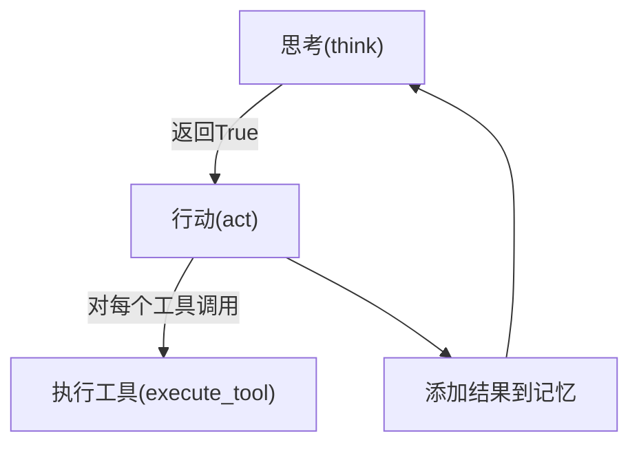

# ToolCallAgent 代码详解

  

`ToolCallAgent` 是 OpenManus 项目中的一个核心基类，它实现了一个能够执行工具调用的智能代理。让我基于代码详细解析其工作原理：

  

## 1. 基础结构和属性

  

```python

class ToolCallAgent(ReActAgent):

```

  

- `ToolCallAgent` 继承自 `ReActAgent`（遵循 Reasoning + Acting 范式）

- 默认提供两个内置工具：`CreateChatCompletion` 和 `Terminate`

- `tool_choices` 属性设置为 `AUTO`，表示允许模型自行决定是否使用工具

- `special_tool_names` 定义了特殊工具名称列表，默认包含 `Terminate` 工具

- `max_steps` 限制代理最大执行步骤数为30步

  

## 2. 思考过程 - think() 方法

  

```python

async def think(self) -> bool:

    # ...

    self.memory.add_message(assistant_msg)

```

  

`think` 方法实现了以下流程：

1. 向代理添加提示，触发思考

2. 调用大语言模型，请求它分析当前状态并决定要用什么工具

3. 处理模型响应，提取工具调用和文本内容

4. 根据不同的工具选择模式处理响应

5. 将结果添加到代理的记忆中

  

## 3. 执行工具 - act() 方法

  

```python

async def act(self) -> str:

    # ...

    return "\n\n".join(results)

```

  

`act` 方法实际执行工具调用：

1. 如果没有工具调用，根据工具选择模式决定如何处理

2. 对每个工具调用，调用 `execute_tool` 方法执行

3. 将执行结果添加到记忆中

4. 返回所有工具执行结果的组合

  

## 4. 单个工具执行 - execute_tool() 方法

  

```python

async def execute_tool(self, command: ToolCall) -> str:

    # ...

    return observation

```

  

`execute_tool` 方法完成单个工具的执行：

1. 验证工具调用参数的有效性

2. 解析工具参数并执行工具

3. 处理特殊工具（如终止工具）

4. 处理可能的图像结果

5. 提供全面的错误处理，确保执行过程的健壮性

  

## 5. 特殊工具处理

  

```python

async def _handle_special_tool(self, name: str, result: Any, **kwargs):

    # ...

    self.state = AgentState.FINISHED

```

  

特殊工具处理机制允许某些工具（如 `Terminate`）改变代理的状态：

1. 检查工具是否为特殊工具

2. 决定是否应该结束执行

3. 如需结束，将代理状态设置为 `FINISHED`

  

## ToolCallAgent 的工作流程

  

整体工作流程是：

1. **思考**：代理通过调用大语言模型分析当前情况并决定下一步操作

2. **行动**：执行思考阶段确定的工具调用

3. **观察**：收集执行结果并将其添加到记忆中

4. **循环**：重复以上步骤直到任务完成或达到最大步骤数

  

这种思考-行动-观察的循环实现了代理的自主决策和执行，使其能够完成各种任务，从简单的聊天到复杂的规划和执行。

  

在 OpenManus 中，`ToolCallAgent` 是专门化代理的基础，每种专用代理通过继承这个基类并添加特定领域的工具和逻辑，构建出适合不同场景的智能代理系统。

  

