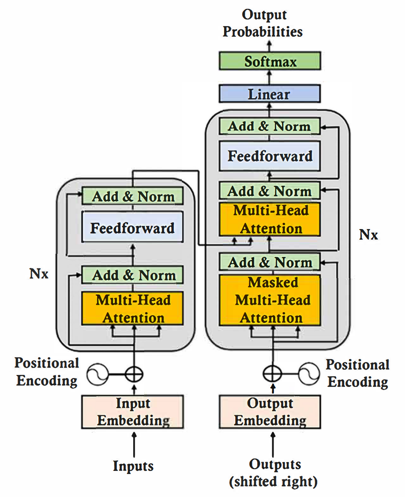
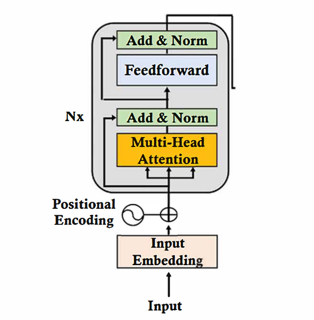
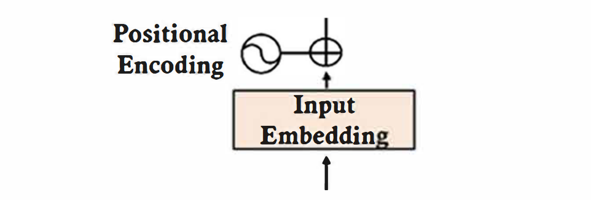
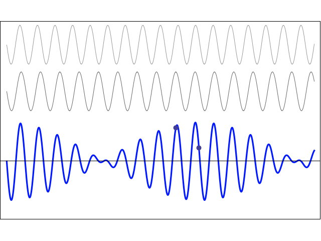
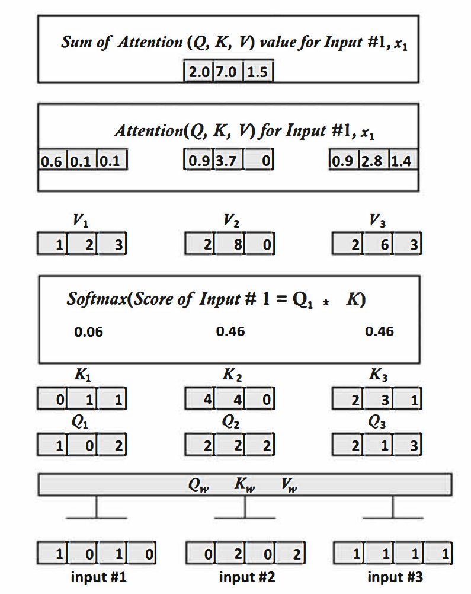
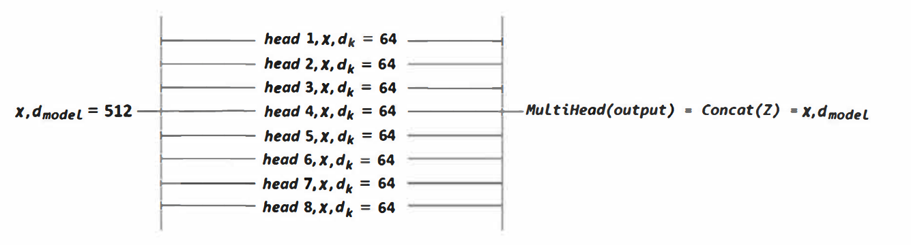
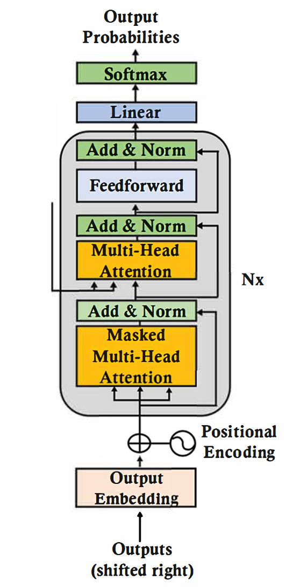

# 第一章：Transformer简介

### 计算复杂度对比

| 模型类型 | 复杂度 | 关键特征 |
|:---:|:---:|:---:|
| **Attention** | O(n²d) | 🔄 并行计算 ↔️ 全局连接 📈 高内存消耗 |
| **RNN** | O(n·d²) | ⛓️ 顺序处理 🌊 梯度消失 📉 低内存消耗 |

> 📝 n: 序列长度, d: 模型维度

#### 对比总结
- RNN虽然计算复杂度较低，但难以处理长序列
- Attention虽然计算量大，但能更好地捕获长距离依赖关系，实际运行速度上，并行计算优势常常可以弥补其较高的理论复杂度

### 模型对比

| RNN | Transformer |
|:--|:--|
| 以循环函数分析标记 | 将每个标记与序列中的其他标记关联起来 |
| 递归的 | 并行的 |

### Transformer发展时间线

| 年份 | 里程碑 | 主要贡献 |
|:--|:--|:--|
| 20世纪初 | 马尔可夫链 | 提出"当前状态决定未来状态"的概念 |
| 1950 | 图灵 | 提出机器智能理论 |
| 1954 | 规则系统 | 首次实现英语-俄语机器翻译 |
| 1982 | Hopfield | 发明RNN循环神经网络 |
| 1980-1990 | LeCun | 开发CNN卷积神经网络，提出LeNet-5 |
| 2017 | Transformer | 提出自注意力机制，开创深度学习新范式 |

### 从一个token推导，直到整个序列
$t = f(n)$，其中$t$为token，$n$为序列长度，$f$为函数

递归地生成：$t_{n+1} = f(t_1, t_2, ..., t_n)$
（隐式地监督学习）

### 基础模型

在超级计算机上训练而成，例如GPT-4、Google BERT、PaLM 2等

- 架构：工业化（并行化、分布式）
- 数据：大规模、多样化
- 计算能力：规模大
- 任务：多样化

# 第二章：Transformer原理

### 自注意力机制：
$$Attention(Q, K, V) = softmax(\frac{QK^T}{\sqrt{d_k}})V$$
就像*搜索引擎*，对于每个query，通过点积计算与所有key的相关性

> **RNN的循环递归计算**
> $h_t = f(h_{t-1}, x_t)$
> 
> 每一步依赖上一步的结果

## 编码器堆栈
> *堆栈*：多层编码器堆叠在一起，每一层都是一个Transformer编码器

每个编码器：多头自注意力机制 + 前馈神经网络 + 残差连接 + 层归一化

$$ LayerNormalization(x + SubLayer(x)) $$

### 词嵌入
#### Word2Vec
- CBOW：根据上下文预测中心词
    > `sit`, `the` $\rightarrow$ `on`
- Skip-gram：根据中心词预测上下文
    > `The cat sits __ the mat` $\rightarrow$ `on`
- 无法解决OOV（Out of Vocabulary）问题，但训练速度快

#### GloVe
- 统计语料库的**词共现信息**，通过*矩阵分解*得到词向量
    > `boy`和`girl`在常常一起出现
    >
    > `gril`和`rock`很少一起出现
- 对高频词的表示更稳定，但低频词学得不好
- 训练速度更快

#### BPE
- Byte Pair Encoding：基于**字符级别**的分词方法
- 通过**词频**合并字符，得到词表
    > `low`和`er`合并为`lower`
    >
    > 经常**共现**的子词合并为新的子词
- 应用于现代 Transformer（GPT, BERT）中

### 位置编码
> 自注意力机制是并行的，反而不如RNN，天生的带有顺序信息，因此要加入位置编码

为了简化注意力层，我们把位置编码加到输入嵌入中，而不是单独作为一个独立的层

正弦和余弦函数来生成位置编码
$$ PE_{(pos, 2i)} = sin(pos / 10000^{2i / d_{model}}) $$
$$ PE_{(pos, 2i+1)} = cos(pos / 10000^{2i / d_{model}}) $$

*不同频率的正弦和余弦函数，可以给不同位置的词生成独立的位置编码*

把位置编码和词嵌入**相加**，得到最终的输入
$$ x = Embedding(x) + PositionalEncoding(x) $$

### 单头注意力

（略）

### 多头注意力

*多头注意力的直观演示*，其中d是维度，z是单个头的输出

最后把单头的z**拼接**起来
$$ MultiHead(Q, K, V) = Concat(head_1, head_2, ..., head_h)W^O $$

> 例如，对于一个512维的输入，我们可以分成8个头，每个头64维，然后拼接起来

### 前馈神经网络（FFN）
$$ FFN(x) = max(0, xW_1 + b_1)W_2 + b_2 $$

## 解码器堆栈

*解码器堆栈的结构*，后半部分与解码器类似

$$Input_Attention = (Output\_decoder\_sub\_layer-1 (Q), Output_encoder_layer(K, V))$$

# 第三章：Transformer的评价指标
### 体验ChatGPT的涌现（emergence）能力
（略）
### GPT的下流任务（downstream tasks）潜能
（略）
### 评价指标
- accuracy
- F1 score
- MCC
- Human evaluation3
- 基准测试集（benchmark）

#### 基准任务和数据集
- GLUE与SuperGLUE：自然语言理解（NLU）基准测试
- ARCT：推理和论证
- Codeforces：代码能力
- AlpacaEval：指令遵循和对齐评估
- ……