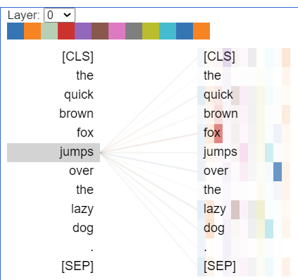
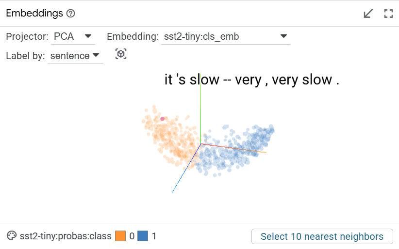

## 可解释性、可视化

### BertViz

*正在观察的是 "jumps" 这个词 在第 0 层的注意力分布情况*

*11个颜色对应着第 0 层的 11 个头*

*颜色越深，表示这个头关于这两个词的注意力权重越高*

*正在观察的是 "jumps" 这个词 在最后一层的注意力分布情况*

*"jumps" 的注意力集中在 "[SEP]" 上*

*说明对整个句子的理解和信息整合，更多地关注句子整体的完成状态*

### SHAP
Shapley值：（读作“傻逼”哈哈哈）
**对于一个特定的预测，每个输入特征对这个预测结果有多大的影响？ 是正向影响还是负向影响？**

遍历一个所有的特征子集，计算每个特征对预测结果的边缘贡献（类似概率论的边缘概率），从而得到每个特征的贡献值。

*红豆生南国，春来发几枝？被判断为消极*

*红色代表支持这个判断，蓝色代表反对这个判断*

*每个词的颜色代表这个词对这个判断的贡献*

### LIME
局部可解释性模型（Local Interpretable Model-agnostic Explanations）

相比于SHAP, LIME通过掩膜（文本扰动）来线性拟合，从而得到每个特征的权重（贡献）

可以适用于任何黑盒模型，相比于SHAP计算量更小，但是只关注单个样本

### PCA
主成分分析（Principal Component Analysis）

找到最重要的视角（数据分布的主要方向），通过投影，让你能在 2D 或 3D 空间中看到数据的分布

*利用LIT的可视化工具，可以看到PCA/UMAP的效果*

### 可解释性的障碍

1. **嵌入层问题**
   - 位置编码的随机性
   - 词嵌入混合难以分析

2. **注意力机制的复杂性**
   - 多头关注点不明确
   - 特征表示多次更新

3. **模型结构带来的困难**
   - Softmax 影响因子模糊
   - Dropout 造成的不确定性
   - 非线性变换的复杂性

4. **其他挑战**
   - 上下文依赖性强
   - 模型规模庞大
   - 训练数据影响难追踪
   
    ……