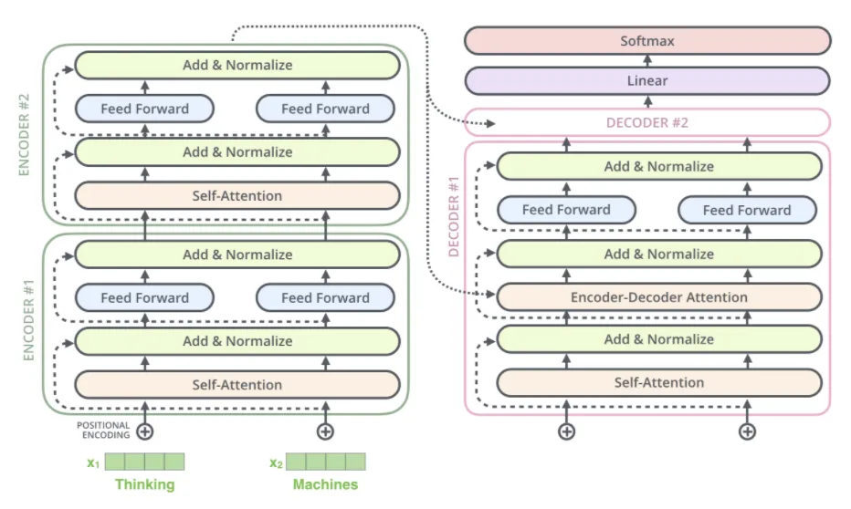

### 语义角色标注（Semantic Role Labeling，SRL）

**结构化**的语义理解方式（围绕**谓词**展开）

> 例如：“小明买了一本书”中
>
> - “小明”是买的主体
> - “书”是买的客体

相比于BERT，实现事件的**结构化**理解，**细颗粒度**的语义角色标注

步骤：
- 谓词识别
- 针对每个谓词的语义角色标注（如施事、受事、工具、时间、地点等）
- 依存或句法分析

#### SRL的问题
- 谓词分析的局限性

- 质疑术语“语义”的使用

### T5（Text-to-Text Transfer Transformer）

每个任务设计和训练不同的模型 -> 一个模型解决所有任务，即“文本到文本”（text-to-text）

输入：通过特定的前缀（如“translate English to French”）指定任务

*T5也是标准的 Transformer Encoder-Decoder 架构*

### PaLM

基于 Pathways 平台
- 稀疏激活：仅激活部分神经元
- 动态路由：动态选择路径

仅解码器（类似GPT），但是细节没有公开

> 2022：PaLM -> 2023：PaLM-2 -> 2023·12：Gemini（谷歌强调 Gemini 是“从头构建”的多模态模型）