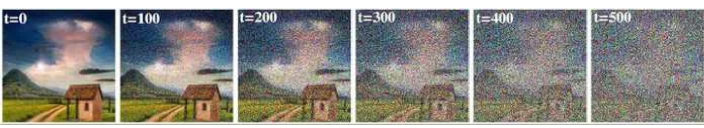
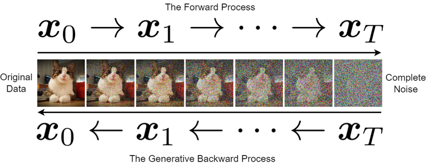
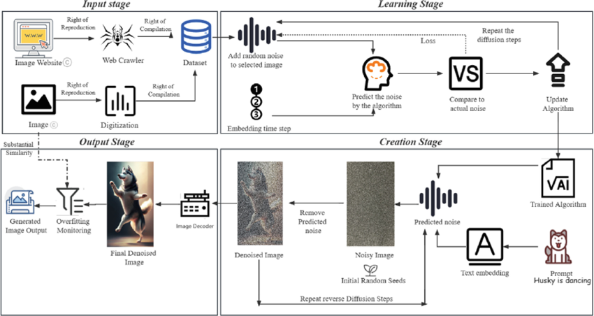
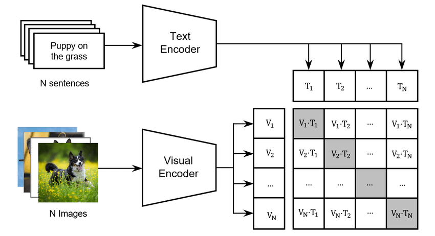
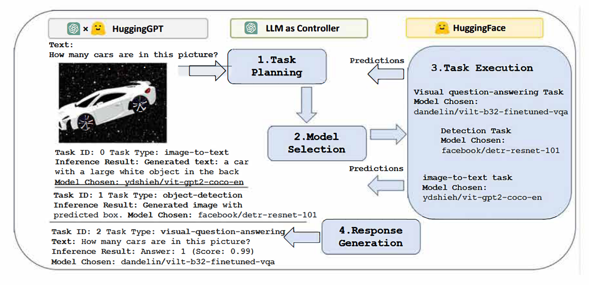
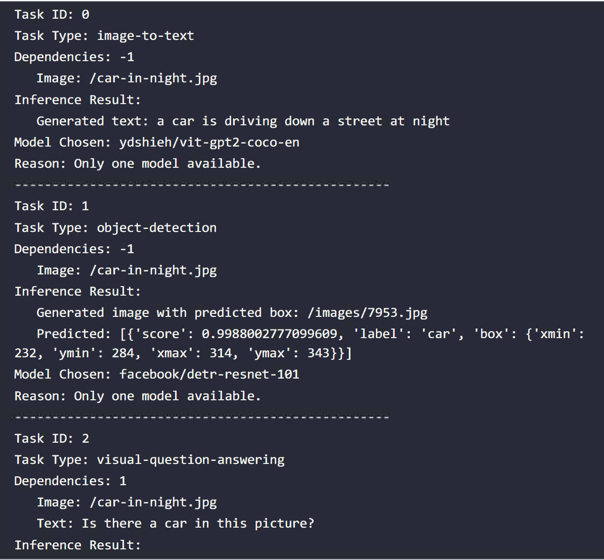
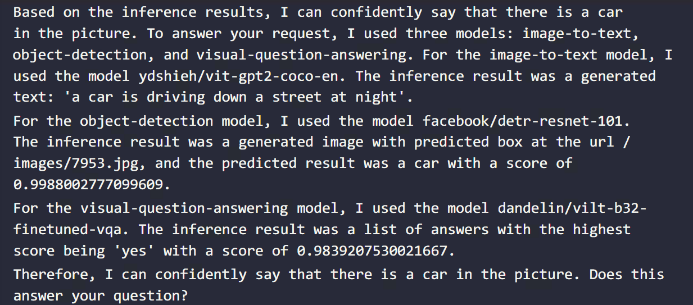

### 语义角色标注（Semantic Role Labeling，SRL）

**结构化**的语义理解方式（围绕**谓词**展开）

> 例如：“小明买了一本书”中
>
> - “小明”是买的主体
> - “书”是买的客体

相比于BERT，实现事件的**结构化**理解，**细颗粒度**的语义角色标注

步骤：
- 谓词识别
- 针对每个谓词的语义角色标注（如施事、受事、工具、时间、地点等）
- 依存或句法分析

#### SRL的问题
- 谓词分析的局限性

- 质疑术语“语义”的使用

### T5（Text-to-Text Transfer Transformer）

每个任务设计和训练不同的模型 -> 一个模型解决所有任务，即“文本到文本”（text-to-text）

输入：通过特定的前缀（如“translate English to French”）指定任务

*T5也是标准的 Transformer Encoder-Decoder 架构*

### PaLM

基于 Pathways 平台
- 稀疏激活：仅激活部分神经元
- 动态路由：动态选择路径

仅解码器（类似GPT），但是细节没有公开

> 2022：PaLM -> 2023：PaLM-2 -> 2023·12：Gemini（谷歌强调 Gemini 是“从头构建”的多模态模型）

### 扩散模型 (Diffusion Model) 

#### 正向扩散过程 (Forward Diffusion Process)：逐步加噪

#### 反向扩散过程 (Reverse Diffusion Process)：逐步去噪
从纯噪声 (例如高斯噪声) 出发，逐步去除噪声，最终**还原**出原始数据

#### 训练
- 数据采样：抽取1个样本
- 正向扩散：逐步加噪
- 预测：预测下一个噪声
- 损失函数：预测的噪声与真实噪声的差异
- 更新参数

> 相比于 GAN，Diffusion Model 
> - 生成：逐步加噪，逐步去噪
> - 训练：噪声预测，而不是对抗训练
> - 更加稳定，不容易出现模式崩溃
> - 可解释性，可控制生成过程（调节每一个步骤的噪声）
> - 基于扩散模型而不是博弈论

*对比各种生成模型的生成过程*

#### Stable Diffusion的架构

##### VAE（变分自编码器）

像素空间与潜在空间之间的转换（编码/解码）

##### U-Net
扩散模型 (Diffusion Model)，负责在潜在空间中进行 噪声预测和去噪

- 编码器：对隐藏向量**降采样**，提取特征，压缩信息
- 解码器：对隐藏向量**上采样**，还原信息
- 跳跃连接 (Skip Connections)：弥补信息丢失

预测在每个扩散步骤中添加到潜在表示中的噪声，且噪声预测过程受到**文本提示**(text prompt) 的**引导**(conditioning)

##### 文本编码器

使用CLIP的文本编码器

##### 调度器 (Scheduler / Sampler)
调度器 (也称为采样器)  控制着扩散过程的节奏和方式
- 如何添加噪声
- 如何去噪

常见如DDPM，Euler 调度器等

### F-AGI
Foundation AGI 构建通用人工智能 (AGI) 

#### HuggingGPT

*HuggingGPT的整体架构*

基于 Hugging Face 生态的 F-AGI 实现
- 通过 GPT-4 分析用户输入（通常是自然语言指令），识别任务类型（如文本生成、图像处理、语音识别等）
- 根据任务类型，调用 Hugging Face Hub 上合适的模型（如图像，语音等）
- 不同模型的输出结果通过 GPT-4 处理，最终生成用户期望的输出。

*对于用户提出“是否有汽车”的请求，HuggingGPT 调用了图像到文本、目标检测、视觉问答三个模型并综合给出了答案*

*最后由 GPT-4 综合各个模型的输出结果*

*参考 HuggingGPT 提出自己的 F-AGI 架构*

##### 模型流水线

级联推理：前一模型的预测结果或特征用于指导下一模型的预测

*我们甚至可以把目标检测标签的概率分布输入GPT-4，让模型决定是否真的有汽车*

