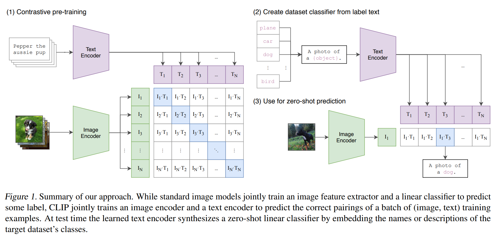

### SAM
segment anything model

#### 整体架构
- 图像编码器：ViT结构（拆分成patch，把图像转换为高维向量）
- 提示编码器：把提示转换为高维向量
- 掩码编码器：将图像编码特征与提示信息融合，生成分割掩码（mask）

#### 图像编码器

切割为patch -> 每个patch作为token -> ViT模型 -> 得到图像特征向量

得到256维张量（类似于CNN的特征图）

#### 提示编码器

Prompt可以是点/框/粗糙掩码/文本（并没有和图像特征对齐）

#### 掩码编码器

*mask decoder是SAM的核心，上图为mask decoder的结构*

- Transformer 交互融合（把两个解码器的特征对齐）
- 自注意力机制计算相关性（区别于faiss的余弦相似度）
- 动态感知卷积（Dynamic Convolution）：
    - 用于生成掩码
    - 通过动态感知卷积，可以在不同位置生成不同的掩码
    （用CNN预测掩码）
- 二值化分割掩码：
    - 通过softmax选择最优的掩码

得到多个候选mask

### CLIP

- 图像编码器：ViT/ResNet
- 文本编码器：BERT
- 对比学习：InfoNCE Loss，根据相似度打分

一个规模空前的图文对数据集上训练

#### 对齐
图像编码器和文本编码器的输出可以是不同的

通过线性投影层（Linear Projection）对齐

维度对齐后再计算相似度

#### 训练
可训练参数：**全量微调**（OpenAI）/只训练投影层

| 模块 | 可训练参数 | 初始化 |
|------|------------|--------|
| 图像编码器 | CNN/ViT的参数 | ImageNet预训练 |
| 文本编码器 | BERT的参数 | BERT预训练 |
| 线性投影层 | 投影矩阵参数 | 随机初始化 |