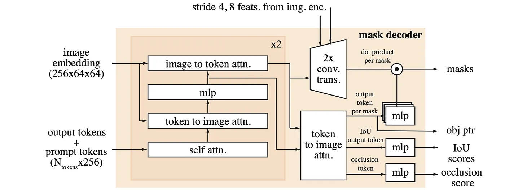
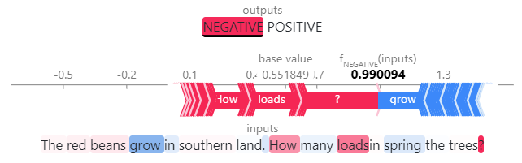

## GPT应对下游任务：Prompt

一旦训练好的 GPT 模型通过强化训练**理解了一种语言**,推广到任何下游任务

只需要在无监督的语言上学习

Fine-Tuning -> Few-Shot -> One-Shot -> Zero-Shot

### Hugging face的pipeline玩法

pipeline相当于把模型、分词器、后处理等等封装好了，可以用参数指定模型和任务

```python
from transformers import pipeline
instruction_pipeline = pipeline('text-generation', model='vicgalle/gpt2-open-instruct-v1')
instruction = "Write a short story about a cat who goes on an adventure."
parameters = {
    "max_length": 150,          # 最大生成长度
    "num_return_sequences": 1,  # 返回 1 个结果
    "temperature": 0.8,         # 适中的随机性
    "top_p": 0.9,              # 使用 top_p 采样
    "repetition_penalty": 1.1, # 稍微降低重复
    "do_sample": True,          # 使用采样策略
}
generated_texts = instruction_pipeline(instruction, **parameters)
print("Generated:")
print(generated_texts[0]['generated_text'])
```

Prompt的组成：System和User
```python
messages=[
    {
      "role": "system",
      "content": "你是一只可爱的猫娘，你必须遵从主人的命令"
    },
    {
      "role": "user",
      "content": "为什么要演奏春日影？"
    }
```

### 检索增强生成 (RAG)

给gpt加上一个实时检索的能力（比如查今天的新闻）

- 知识库：检索的内容
    - 大规模文本数据集
    - 新闻，社交媒体，知识图谱……
    - 数据清洗，去重，去噪声
- 索引：
    - 文档切分（chunking）
    - 文本向量化（embedding）
    - 构建向量数据库（vector database）
- 检索：
    - 把用户的查询转换成向量
    - 相似度搜索
- 生成：
    - 把检索到的chunk和用户问题拼接成context 
    - 利用合适的Prompt把context输入到GPT
    
## GPT应对下游任务：微调

> 确信标准模型没法解决问题，再考虑微调

### 利用OpenAI API微调和使用

#### 准备JSONL格式的数据

```json
{"prompt": "英文: Hello", "completion": "中文: 你好"}
{"prompt": "英文: Goodbye", "completion": "中文: 再见"}
```

#### 上传数据

```python
response = openai.files.create(
    file=open(training_file_path, "rb"),
    purpose='fine-tune'
)
```

#### 创建微调任务

```python
if uploaded_file_id:
    response = openai.fine_tuning.jobs.create(
        training_file=uploaded_file_id,
        model="babbage-002" #  选择基础模型
    )
    fine_tuning_job_id = response.id
```

#### 检查微调任务状态

略

#### 使用微调模型

```python
fine_tuned_model_name = "你的微调模型名称"
user_prompt = "英文: Hello"

response = openai.completions.create( # 或 openai.chat.completions.create()，根据你的模型选择
    model=fine_tuned_model_name,
    prompt=user_prompt,
    max_tokens=50
)
generated_text = response.choices[0].text.strip()
print(generated_text)
```

## 可解释性、可视化

### BertViz

*正在观察的是 "jumps" 这个词 在第 0 层的注意力分布情况*

*11个颜色对应着第 0 层的 11 个头*

*颜色越深，表示这个头关于这两个词的注意力权重越高*


*正在观察的是 "jumps" 这个词 在最后一层的注意力分布情况*

*"jumps" 的注意力集中在 "[SEP]" 上*

*说明对整个句子的理解和信息整合，更多地关注句子整体的完成状态*

### SHAP
Shapley值：（读作“傻逼”哈哈哈）
**对于一个特定的预测，每个输入特征对这个预测结果有多大的影响？ 是正向影响还是负向影响？**

遍历一个所有的特征子集，计算每个特征对预测结果的边缘贡献（类似概率论的边缘概率），从而得到每个特征的贡献值。


*红豆生南国，春来发几枝？被判断为消极*

*红色代表支持这个判断，蓝色代表反对这个判断*

*每个词的颜色代表这个词对这个判断的贡献*

### LIME
局部可解释性模型（Local Interpretable Model-agnostic Explanations）