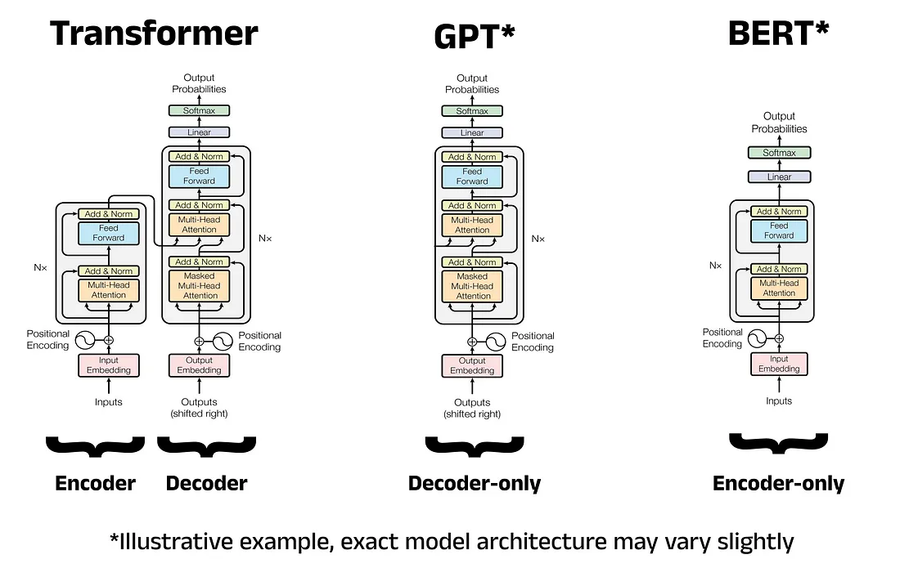
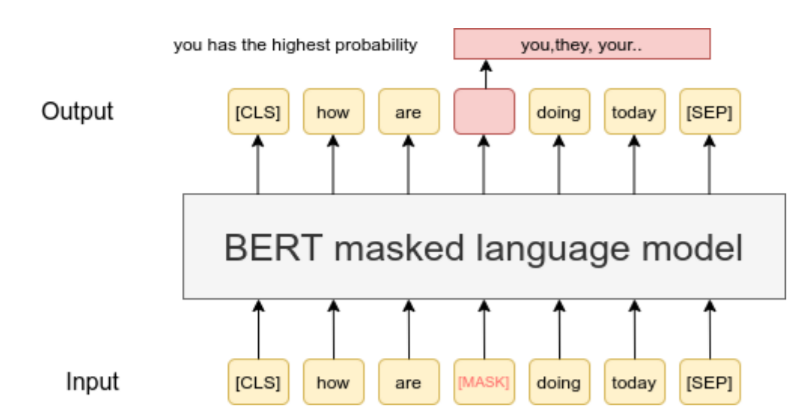
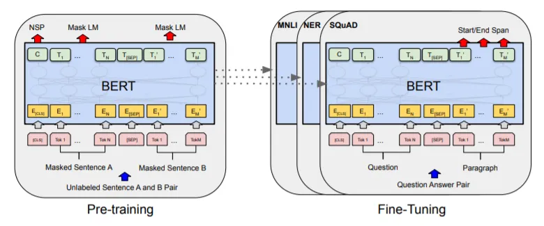
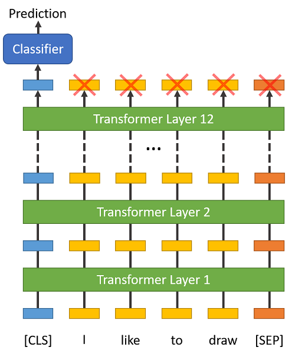
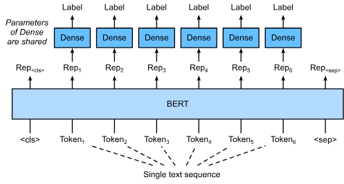
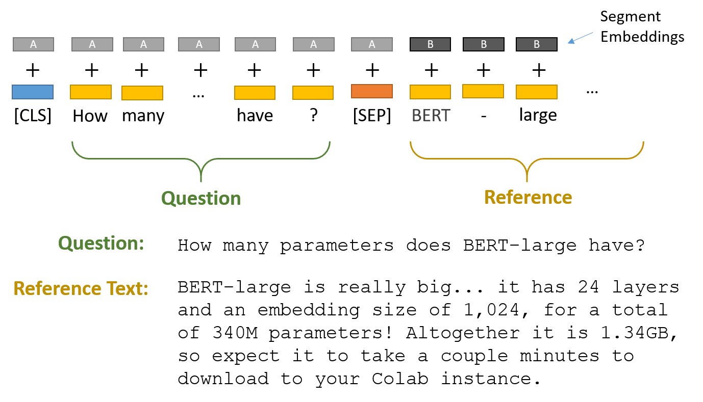
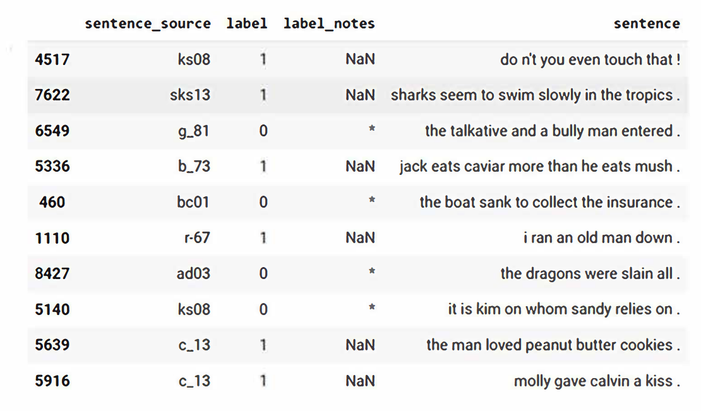

# 第五章
## BERT架构
 Bidirectional Encoder Representations from Transformers (基于 Transformer 的**双向**编码器表征)

### 核心：Encoder

*BERT*只使用了Transformer的Encoder部分，因为它是一个无监督的模型，不需要Decoder。

BERT同时可以看到左右两边的词，这是因为它使用了双向Transformer。（因此如上图，并不是自回归的）

BERT 的目标是：学习到能够代表词语和句子语义的、富含上下文信息的 “隐藏状态 (hidden states)”（一次性理解整个输入序列的语义，而不是为了预测下一个词）

### MLM（掩码语言建模）

核心目的： 让 BERT 学习双向的上下文信息，理解词语在句子中的含义。

*MLM示意图*

- Masking：在输入序列中随机选择一些词，然后用特殊的 [MASK] 词来替换它们。或者保留/替换为随机词。

- 预测：模型的目标是预测这些 [MASK] 词的原始词。

### NSP（下一句预测）
核心目的： 让 BERT 学习理解句子与句子之间的关系，特别是判断**两个句子是否是连续的上下文**。

- 构建训练数据：
    - 正例：语料库连续抽取两个句子
    - 负例：语料库随机抽取两个句子
- 预测：模型的目标是预测两个句子是否是连续的上下文。（输出一个二分类标签CLS）

> *为了训练NSP，BERT在输入中添加了两个特殊的分类标签：[CLS]和[SEP]，*
> - [CLS]用于表示句子的开始
> - [SEP]用于分隔两个句子

### 联合训练
它们并不是两种独立的训练算法，而是 BERT 预训练的   两个**目标函数**。（*同时最小化两个目标函数的损失*）

*在一个batch中，BERT同时训练MLM和NSP，损失函数是两者之和，共享参数*

### 总结
BERT模型的输入嵌入和位置编码包含以下几个关键组成部分：

#### 1. 词元化处理
- 输入的单词序列会被分解成WordPiece词元
- 添加特殊词元:
  - `[MASK]`: 随机替换原始词元，用于MLM任务
  - `[CLS]`: 插入序列开头，用于分类任务
  - `[SEP]`: 用于分隔两个句子，支持NSP任务

> WordPiece是也是一种利用子词的分词器（类似bpe），可以处理OOV问题。
> 
> 相比bpe（合并最频繁的字节对），WordPiece更加复杂（最大化语言模型似然度），更适合理解语义。

#### 2. 嵌入层
- **词元嵌入**: 将每个词元转换为向量表示
- **句子嵌入**: 为不同句子添加不同的句子标识嵌入
  - 句子A和句子B具有不同的句子嵌入值
  - 帮助模型区分不同句子的边界

#### 3. 位置编码
- 采用**可学习**的位置编码方式
- 区别于原始Transformer使用的固定正弦-余弦位置编码
- 通过学习更好地适应特定任务需求

## BERT微调
在预训练好的*BERT 模型*之上，**添加任务特定的输出层**，然后*端到端地微调整个模型*。

> BERT的*下游任务*目标通常是利用预训练知识解决特定**判别任务**，不具有生成能力。
>
> 相反，GPT的微调只需要**引导模型生成期望类型的文本**，甚至可以用*Prompt工程*替代分类器。

同样，**最后一层** Transformer 块的输出 (隐藏向量) ，具有最丰富的特征，作为下游任务的**输入**

### 任务特定输出层

#### 分类层

*目标是利用[CLS]的隐藏状态，把**整个句子**划分到不同的类别*

**分类器**：全连接 -> softmax -> dropout -> 输出

#### 序列标注层

利用每个token对应的隐藏状态，把**每个词**划分到不同的类别

同样是全连接**分类器**，但是输出维度是标签的数量。

#### 问答层

给定一个 问题和一个 上下文，模型需要从上下文中 “抽取” 出 答案片段 (Answer Span) 的 起始位置 (start position) 和 结束位置 (end position)。

- **起始位置预测层**：由“每个 token” 的 Hidden State，输出 “每个 token 作为答案片段起始位置的概率”
- **结束位置预测层**

### CoLA任务

可接受语料库（二分类）：判断句子是否是流畅、符合语法

### 评价：MCC
适用于**不平衡**数据集，防止模型只擅长预测占比大的类别，而忽略了占比小的类别。