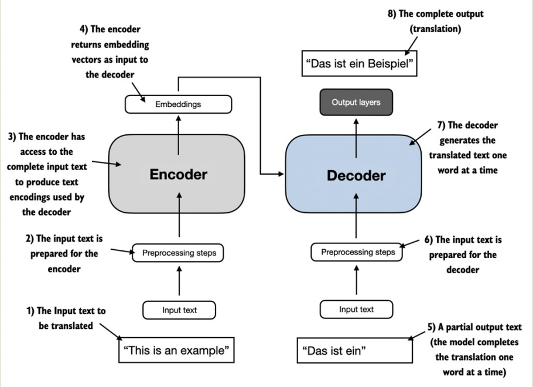
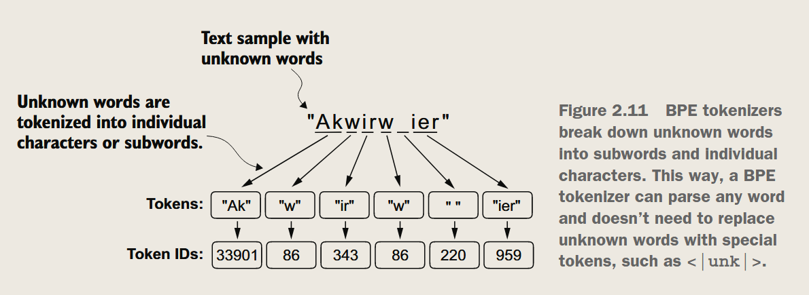
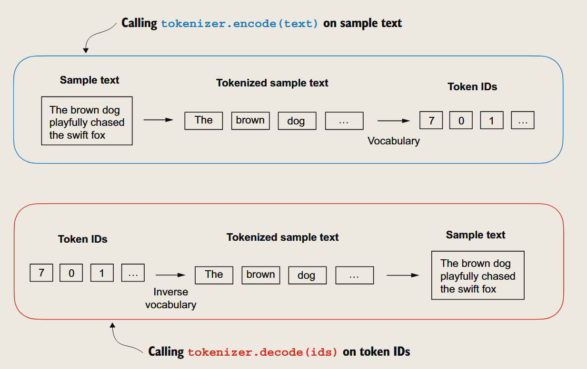
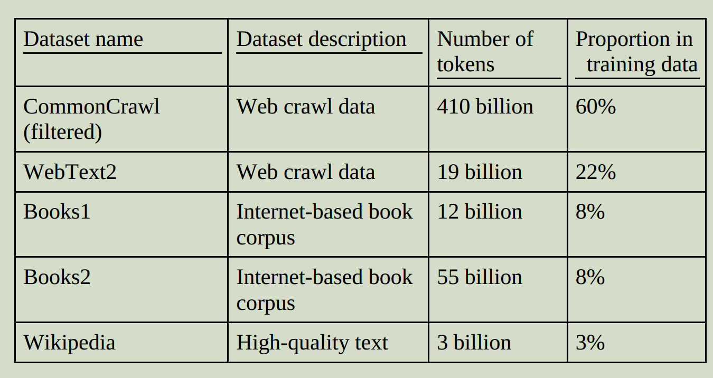
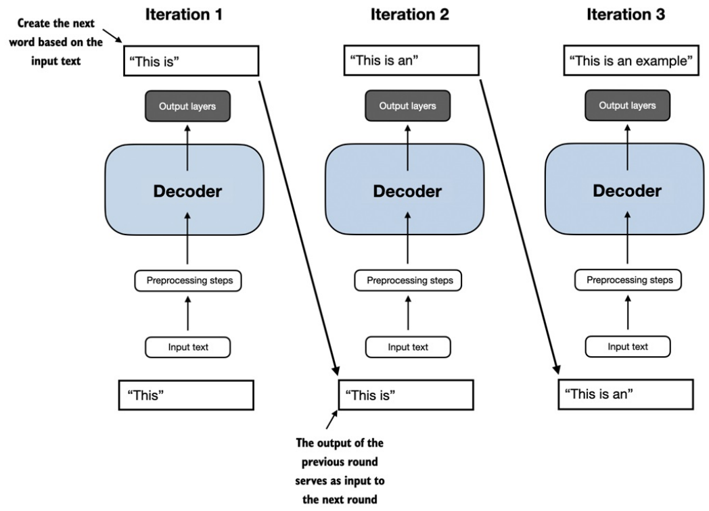

### 🚀 LLM训练过程

🤖 预训练模型：
- 语言模型：BERT
- 目标检测模型：YOLOv3

🎯 微调模型：
- 语言模型：GROK(fun)（在有标记的数据集上fine-tune得到的模型）
- 目标检测模型：YOLOv3（比如用户在自己的数据集上model.train()得到的模型）

> ⚠️ **Warning**  
> 必须知道模型架构，才能进行微调。

### 🔄 早期transformer的应用

*用于英语到德语的翻译任务。*

**编码器**
- 文本 -> 词向量

**解码器**
- 词向量 -> 文本

### 🆚 BERT与GPT的区别

BERT
- 🔄 **双向**
- 🎭 **掩码**语言模型

>Propmt: "We ___ to go to the ___"
>
>Answer: "choose, moon"
就像做**完形填空**

GPT
- ➡️ 单向（从左到右）
- 🔄 自回归语言模型

> Prompt: "We choose to go to the ___"
>
> Answer: "moon"
像玩**接龙游戏**

### 🎓 Zero-shot vs Few-shot学习

*就是提示词和预期结果的区别*

**Zero-shot（零样本学习）**

- 不需要任何特定任务的**举例**
- 直接使用模型完成任务

>Propmt: "Translate from English to French: Apple"
>
>Answer: "Pommel"

**Few-shot（少样本学习）**
- 给模型提供少量示例
- 模型根据示例模式来完成任务
> Propmt: "water is to fish as air is to ?"
>
> Answer: "bird"

### 📚 GPT-3的数据集

语料库：common crawl(570GB) + webtext + books(gutenberg.org等) + wikipedia

成本：$4.6M 

### ⚙️ Transformer 的解码器

预测下一个词是一种**自监督**的任务，原始文本中的下一个词就是**标签**。

> 示例：
> "我喜欢人工智能"
>
> “我” -> “喜欢” 
> “喜欢” -> “人工智能”

### 🎯 本书的三个步骤

✨ **Step 1**：构建一个语言模型
- 数据准备
- 自注意力机制
- LLM架构

🚀 **Step 2**：预训练以创建基础模型
- 训练循环
- 模型评价
- 加载权重

🎨 **Step 3**：微调模型
- 利用有标签的数据集
- 制作一个个人助手

### 📝 总结

#### 🌟 LLM的革新
- LLM革新了自然语言处理领域
- 从规则系统和统计方法转向深度学习驱动
- 提升了语言理解、生成和翻译能力

#### 🔄 训练过程
1. **预训练阶段**
   - 使用大规模未标记文本
   - 通过预测下一个词作为"标签"
2. **微调阶段**
   - 在较小的标记数据集上微调
   - 用于指令跟随或分类任务

#### 🏗️ 架构特点
- 基于transformer架构
- 核心是注意力机制
- 可选择性访问整个输入序列
- GPT类模型仅使用解码器模块

#### 💡 关键特性
- 需要大规模数据集预训练
- 展现"涌现"能力（分类、翻译、摘要等）
- 预训练后的基础模型可高效微调
- 针对特定任务的微调模型表现更好

> ⚠️ **注意**：本书将使用小数据集进行演示，但也会学习如何加载开源模型权重