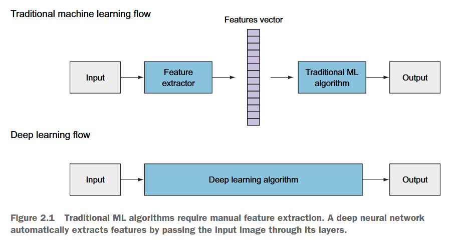
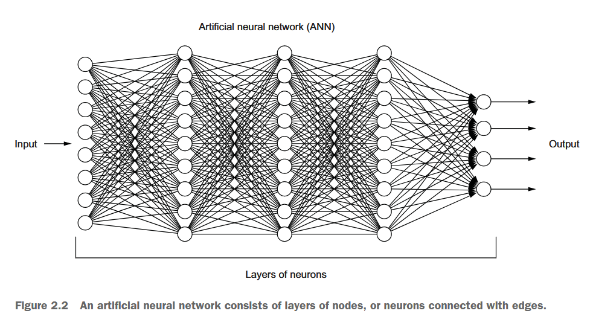
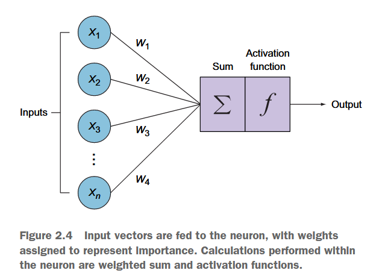
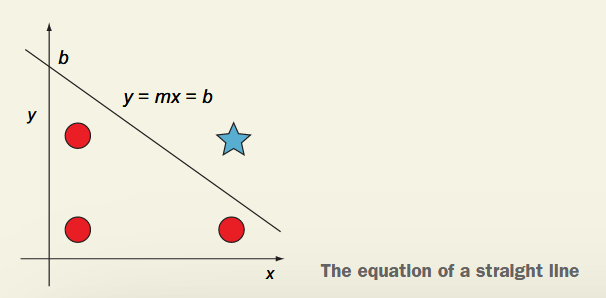
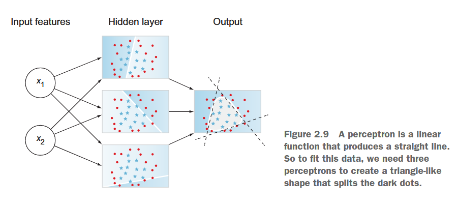
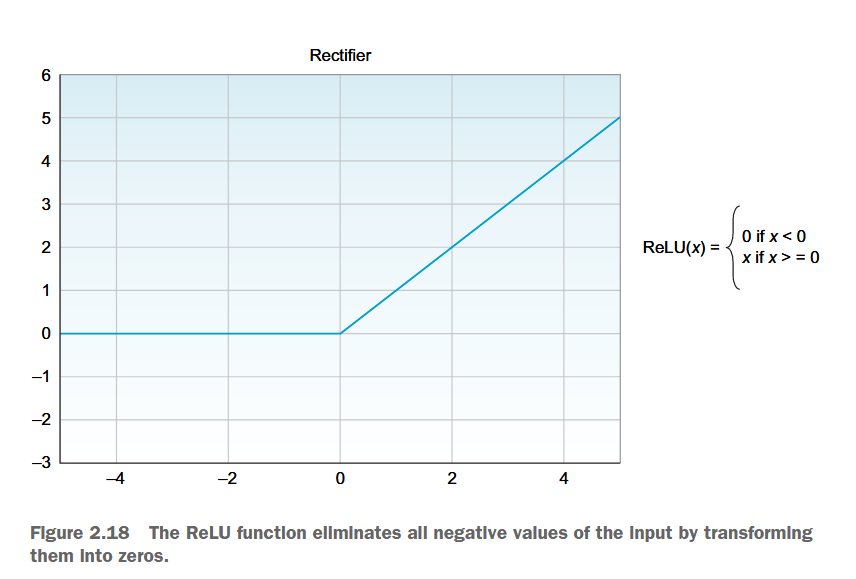
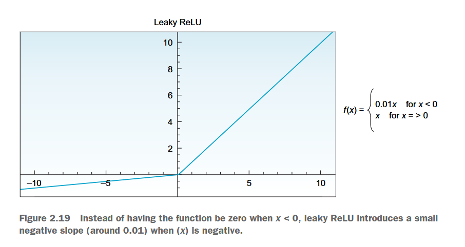
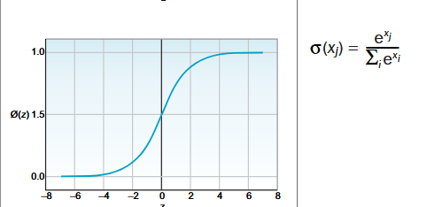
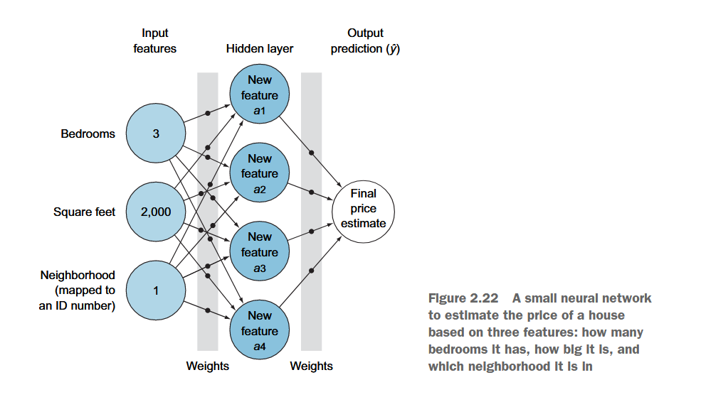
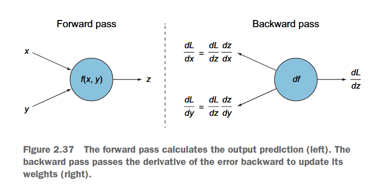

### 对比传统ML与深度学习

*神经网络既提取特征，又进行分类*

### ANN（也称MLP）
**人工神经网络**（Artificial Neural Network）也称**多层感知机**（Multi-Layer Perceptron）

是全连接的神经网络，由输入层、隐藏层、输出层组成。

*图中的每个节点都是一个神经元，可见，参数量非常滴大*

### 神经元
神经元是神经网络的基本单元，模仿人脑的神经元，接收输入信号，输出信号。

特征向量 -> 加权求和 -> 激活函数 -> 输出

#### 加权和函数
$$z = \sum x_i · w_i + b (bias)$$

*如果没有bias，那么决策边界要经过原点，未必能分隔开数据*

#### 激活函数
激活函数是神经元的非线性变换，使神经元能够学习非线性函数。

输入（加权和） -> 激活函数 -> 输出（激活值）

> 同样是上图的例子，如果没有激活函数，那么分隔线就是一条直线，未必能分隔开数据

### 多层感知机架构

##### 为什么

*如图形象地理解，解决非线性问题需要多条“线段”分隔数据*

输入层 -> **隐藏层** -> 输出层

#### 隐藏层
为什么叫隐藏层？因为它在输入层和输出层之间，不直接与外界交互。

隐藏层通过神经元带权重的连接（边），因此可以学习更复杂的模式。

##### 设计超参数
- 隐藏层的数量

    隐藏层的数量越多，神经网络的表达能力越强，但也越容易**过拟合**。

- 优化器（optimizer）

    优化器是根据梯度，更新权重的算法，如SGD、Adam、RMSprop等。

- 激活函数

    推荐：
    - ReLU：隐藏层
    - Sigmoid：输出层（二分类）
    - Softmax：输出层（多分类）
> 常见激活函数的图像
>
> 
> *ReLU是最常用的激活函数，因为它的导数在大部分区域都是1，不会出现梯度消失的问题*
>
> 
> *Leaky ReLU是ReLU的改进，解决了ReLU的负数区域梯度为0的问题*
>
>
> *Sigmoid是用于二分类问题的激活函数，将输出转化为概率分布*
>
> 
> *Softmax是用于多分类问题的激活函数，将输出转化为概率分布*

#### 输出层
- 分类问题：输出一个概率分布 -> softmax
- 回归问题：输出一个实数

### 前向传播
前向传播是神经网络从输入层到输出层的计算过程。

输出：网络的**预测结果**。

*其实就是矩阵运算的过程*

*根据当前的“策略”完成任务，更新参数靠的是反向传播*

#### 特征学习

*输入的特征向量在隐藏层组合，形成新的特征向量。*

（学习模式中的模式，模式中的模式的模式……）

### 损失函数

评价前向传播的结果与真实值的差距。

- 分类问题：交叉熵（Cross Entropy）

    $$L = - \sum y_i log(\hat{y_i})$$
    *就像考试打分，答对了得分高，答错了扣分少，但不会因为错得太离谱而扣光。*

    结果在0-1之间，越接近1，表示预测越准确。对异常值不敏感，对**概率分布的差异敏感**。
- 回归问题：均方差（MSE）

    $$L = \frac{1}{n} \sum (y_i - \hat{y_i})^2$$
    *就是测量两点之间的距离，越接近0，表示预测越准确。*

    结果在0-正无穷之间，越接近0，表示预测越准确。对异常值敏感。对**大误差**惩罚更重。

### 优化器

*因此，优化器就是沿着参数-损失函数的梯度方向，更新参数，使损失函数最小化。*

更新权重和偏置

- 梯度下降（Gradient Descent）

    $$w = w - \alpha \frac{\partial L}{\partial w}$$
    *$\alpha$是学习率，是一个超参数，控制参数更新的步长。*

- 随机梯度下降（SGD）

    每次迭代，随机选择一个样本，计算梯度，更新参数。

*对比梯度下降和随机梯度下降：GD采用整体数据计算梯度，SGD采用单个样本计算梯度。*

- 小批量梯度下降（Mini-Batch Gradient Descent）

    每次迭代，随机选择一批样本，利用GD更新参数。
    *折中GD和SGD*

- 其他优化器（详见第四章）

    - Adam
    - RMSprop
    - Adagrad
    - Adadelta

### 反向传播

从后往前计算出**每一层**的**误差**，更新每一层的**权重**

*利用链式法则计算出每一层的梯度，更新参数*

## 小结
感知器适用于可以通过一条直线分隔的数据集（线性运算）。

对于无法用直线建模的非线性数据集，需要一个包含多个神经元的更复杂的神经网络。通过将神经元堆叠成层，形成了多层感知器。

网络通过重复三个主要步骤来学习：前向传播、计算误差和优化权重。

参数是网络在训练过程中更新的变量，如权重和偏置。这些是由模型在训练期间自动调整的。

超参数是由你来调整的变量，例如层数、激活函数、损失函数、优化器、早停和学习率。我们在训练模型之前调整这些参数。